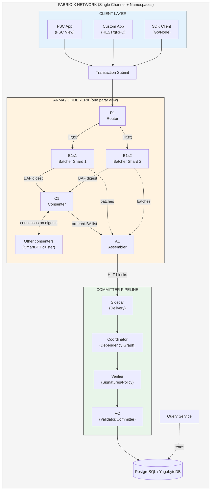
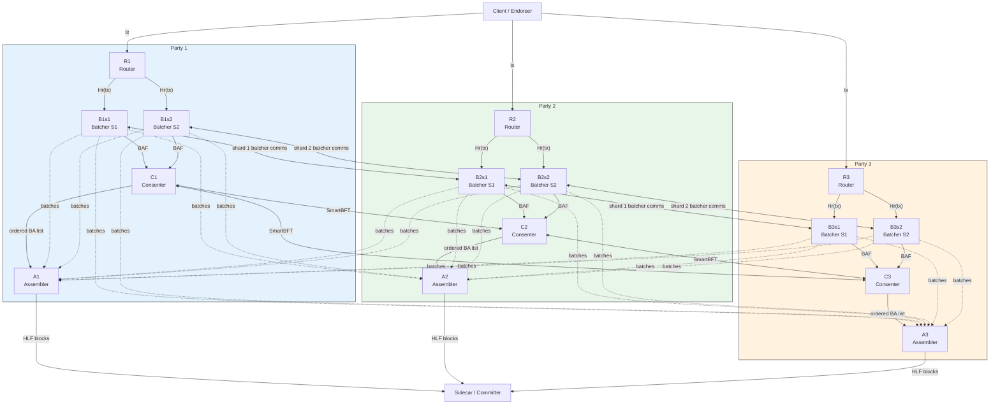

<!-- SPDX-License-Identifier: Apache-2.0 -->
# Fabric-X Architecture Reference

## Overview

Fabric-X represents a fundamental re-architecture of Hyperledger Fabric, designed from the ground up for **mission-critical enterprise workloads** requiring Byzantine Fault Tolerance, horizontal scalability, and high throughput. This document provides a comprehensive architectural reference covering system design, major components, interaction patterns, and guiding principles.

## Architecture Topics

- [Detailed Transaction Architecture](transaction-flow.md) — end-to-end transaction-flow diagrams and service interactions.
- [Arma Ordering](../orderer/docs/architecture.md) — ordering-service architecture.
- Router — client request admission and routing.
- Batcher — transaction batching and batch data service.
- Consenter — BFT ordering decisions.
- Assembler — block assembly and delivery.
- [Committer Pipeline](../committer/docs/architecture.md) — validation and commit architecture.
- [Sidecar](../committer/docs/sidecar.md) — block ingestion and delivery.
- [Coordinator](../committer/docs/coordinator.md) — dependency analysis and orchestration.
- [Verifier](../committer/docs/verification-service.md) — signature and namespace-policy verification.
- [Validator-Committer](../committer/docs/validator-committer.md) — MVCC validation and database commit.

!!! info "Performance Note"
    Fabric-X is designed for high-throughput deployments. Actual throughput depends on workload, hardware, shard count, database, and network conditions. Run benchmarks for deployment-specific numbers.

### Key Architectural Innovations

| Innovation | Fabric Classic | Fabric-X | Improvement |
|------------|---------------|----------|-------------|
| **Ordering Service** | Monolithic orderer | **Arma**: 4 microservices (Router, Batcher, Consenter, Assembler) | Horizontal scalability, BFT consensus |
| **Commitment** | Monolithic peer | **Pipeline services**: Sidecar, Coordinator, Verifier, Validator-Committer | Parallel validation and independent scaling |
| **Endorsement** | Fabric peer execution path | **FSC views** or custom endorsers (native processes) | Native-process endorsement path |
| **Consensus** | Raft (Crash Fault Tolerant) | **SmartBFT** (Byzantine Fault Tolerant) | Tolerates malicious nodes |
| **Network Model** | Multi-channel complexity | **Single channel + namespaces** | Simplified operations, logical isolation |
| **Storage** | Peer-local state database | **Sharded PostgreSQL/YugabyteDB** | Horizontal scalability, rich queries |

---

## Design Constraints

| Constraint | Status | Rationale |
|------------|--------|-----------|
| **mTLS** | Mandatory | All inter-node communication requires mutual TLS. External TLS (`TLS.Enabled`) affects only external APIs, but internal mTLS is always enforced. |
| **Single Channel** | Architectural choice | Namespaces replace channels for logical isolation. Multi-channel not supported. |
| **No Private Data Collections** | Not implemented | Use namespace isolation + application-level encryption instead. |

---

## System Architecture

### High-Level Architecture

### Architectural Layers

| Layer | Components | Responsibility |
|-------|------------|----------------|
| **Client** | FSC Apps, Custom Apps, SDKs | Transaction submission, state queries |
| **Ordering** | Arma (Router, Batcher, Consenter, Assembler) | Transaction ordering, BFT consensus, block assembly |
| **Commitment** | Pipeline (Sidecar, Coordinator, Verifier, Validator-Committer (VC)) | Parallel validation, policy enforcement, state updates |
| **Query** | Query Service | Client state queries (NOT in validation pipeline) |
| **Storage** | Sharded PostgreSQL/YugabyteDB | World state persistence, transaction log |

---

## Major Components

### 1. Arma Ordering Service

**Purpose:** Byzantine Fault Tolerant ordering service that receives transactions, reaches consensus on their order, and produces blocks.

**Architecture:** each Arma party replaces one traditional OS node and contains a router, one batcher per shard, a consenter, and an assembler. Parties run `3f + 1` SmartBFT consenters to tolerate `f` Byzantine parties. Arma separates full transaction dissemination from consensus by ordering compact batch digests.

#### Component Responsibilities

| Component | Role | Key Responsibilities | Performance Target |
|-----------|------|---------------------|-------------------|
| **Router** | Entry point | Validate transactions, authenticate clients, compute deterministic `Hr(tx)` shard mapping | Horizontally scalable |
| **Batcher** | Transaction grouping | Batch per shard, persist batches, disseminate primary batches to secondaries, generate BAFs | Scales by shard count |
| **Consenter** | Consensus | Run SmartBFT on BAF digests, order Batch Attestations, order complaint votes | BFT finality |
| **Assembler** | Block assembly | Pull ordered metadata from own consenter, fetch batches from shard batchers, construct Fabric blocks | Parallel block assembly |

> **Note:** BAF (Batch Attestation Fragment) is an internal Arma structure used for consensus. It is not exposed to the Committer pipeline.

#### VC Internal Structure

The Validator-Committer (VC) service consists of three internal components:

| Component | Responsibility |
|-----------|----------------|
| **Preparer** | Prepares transactions for validation, checks namespace policies |
| **Validator** | Performs MVCC conflict detection, validates read-write sets |
| **Committer** | Commits validated transactions to database, updates world state |
