<!-- SPDX-License-Identifier: Apache-2.0 -->
# Transaction Flow in Fabric-X

## Overview

This document provides a comprehensive walkthrough of the complete transaction lifecycle in Fabric-X, from client submission through final commitment to the ledger.

Fabric-X implements a **three-phase transaction model**. The **Endorsement Phase** handles transaction simulation and signature collection through FSC. The **Ordering Phase** sequences transactions and constructs blocks via the Arma service. Finally, the **Commitment Phase** performs parallel validation and state updates through the Committer pipeline.

!!! info "Timing Disclaimer"
    Latency numbers in this document are **estimates based on architecture analysis**, not measured performance. Actual performance depends on hardware, network conditions, workload characteristics, and configuration. Use these numbers as rough guidelines for understanding the transaction flow, not as performance guarantees.

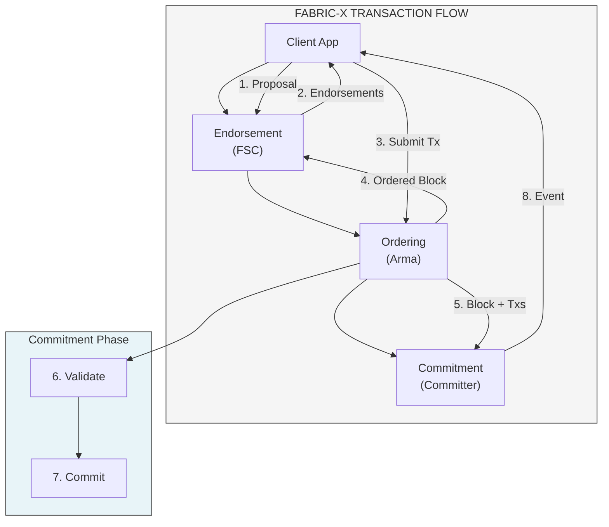

*Total Latency: 300-600ms (typical production workload)*

## Phase 1: Endorsement

### 1.1 Transaction Proposal

The transaction flow begins when a client application constructs a **transaction proposal**. Fabric-X uses **FSC (Fabric-Smart-Client) views** that run as native Go code.

The proposal contains three main sections. The **Header** carries routing and identity metadata including the channel ID, namespace ID, transaction ID, timestamp, proposer's X.509 certificate, and a 16-byte nonce for replay protection. The **Payload** holds the actual transaction logic: the function name to invoke (such as "Transfer"), arguments (like account names and amounts), an optional read-set hint for optimization, and any encrypted transient data. Finally, the **Signature** section contains an ECDSA signature computed over the Header and Payload, cryptographically binding the proposer's identity to the transaction request.

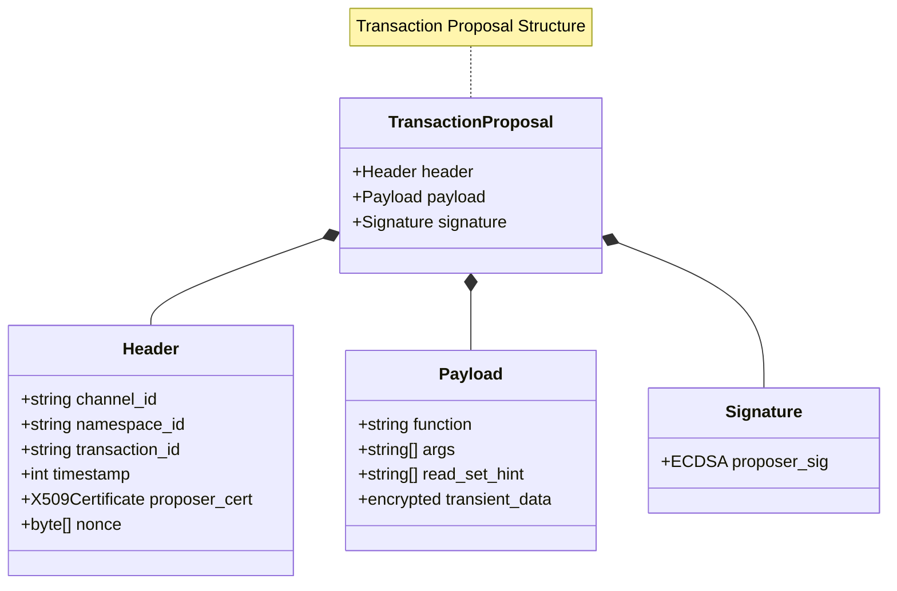

### 1.2 Endorser Simulation

Endorsers receive the proposal and execute the **simulation phase**, producing a read-write set without modifying actual state. The process follows a sequential pipeline: first receiving and parsing the proposal, then reading the current state from a snapshot, executing the transaction logic against that snapshot, building the resulting read-write set, signing the RW set hash, and finally returning the endorsement response to the client.

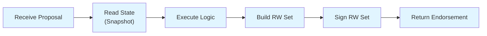

The **Endorsement Response** contains the proposal ID, the read-write set (with read entries showing key-version pairs and write entries containing key-value pairs), the endorser's X.509 certificate, an ECDSA signature over the RW set hash, and a timestamp.

### 1.3 Endorsement Policy Evaluation

The client collects endorsements and evaluates the **endorsement policy** configured for the namespace. Policies define which organizations must endorse a transaction for it to be considered valid. The `OR` policy requires endorsement from any single organization in the set, while `AND` demands signatures from all specified organizations. For more flexible governance, `NOutOf` policies allow transactions to proceed with a subset of endorsers, such as requiring any 2 out of 3 organizations.

| Policy | Meaning | Endorsements Required |
|--------|---------|----------------------|
| `OR(Org1.member, Org2.member)` | Any org | 1 from Org1 OR Org2 |
| `AND(Org1.member, Org2.member)` | All orgs | 1 from Org1 AND 1 from Org2 |
| `NOutOf(2, Org1.member, Org2.member, Org3.member)` | Majority | Any 2 of 3 orgs |

### 1.4 Timing - Endorsement Phase

The endorsement phase typically completes in 25ms at P50 and 100ms at P99 when using two parallel endorsers. Proposal creation and policy evaluation happen client-side in about 1ms each. Network latency to and from endorsers accounts for roughly 10ms round-trip at P50. The simulation execution within the FSC view takes approximately 10ms, while ECDSA P-256 signature generation adds another 2ms.

## Phase 2: Ordering

### 2.1 Transaction Submission to Arma

The client submits the assembled transaction to the **Arma ordering service** via a Router microservice. The Router performs validation in sequence: checking transaction format (rejecting with 400 if invalid), verifying the proposer's signature (401 on failure), checking for duplicate nonces to prevent replay attacks (409 if already used), mapping the transaction to the correct shard, and forwarding to the Batcher. Upon successful validation, the Router returns an acknowledgment containing the transaction ID and assigned shard ID.

### 2.2 Batching and BAF Generation

The **Batcher** microservice collects transactions into batches and generates a **Batch Attestation Fragment (BAF)**. Transactions accumulate in a pending pool until one of three thresholds is triggered: batch size reaches 500 transactions, batch bytes exceed 5MB, or the batch timeout of 50ms elapses. When any threshold fires, the Batcher seals the batch and proceeds to BAF generation.

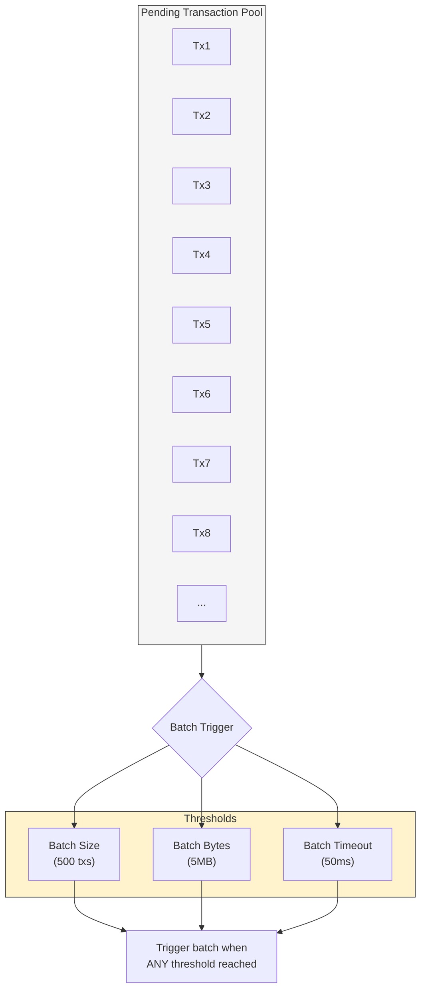

**BAF Structure:**

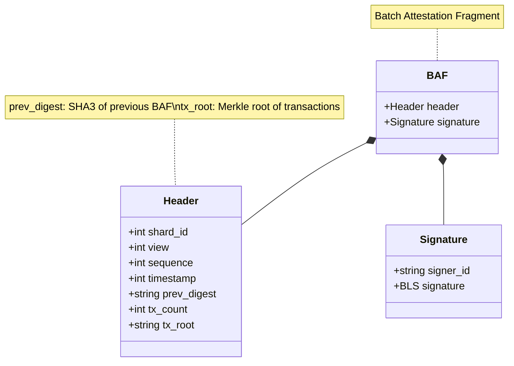

**Merkle Tree for Transactions:**

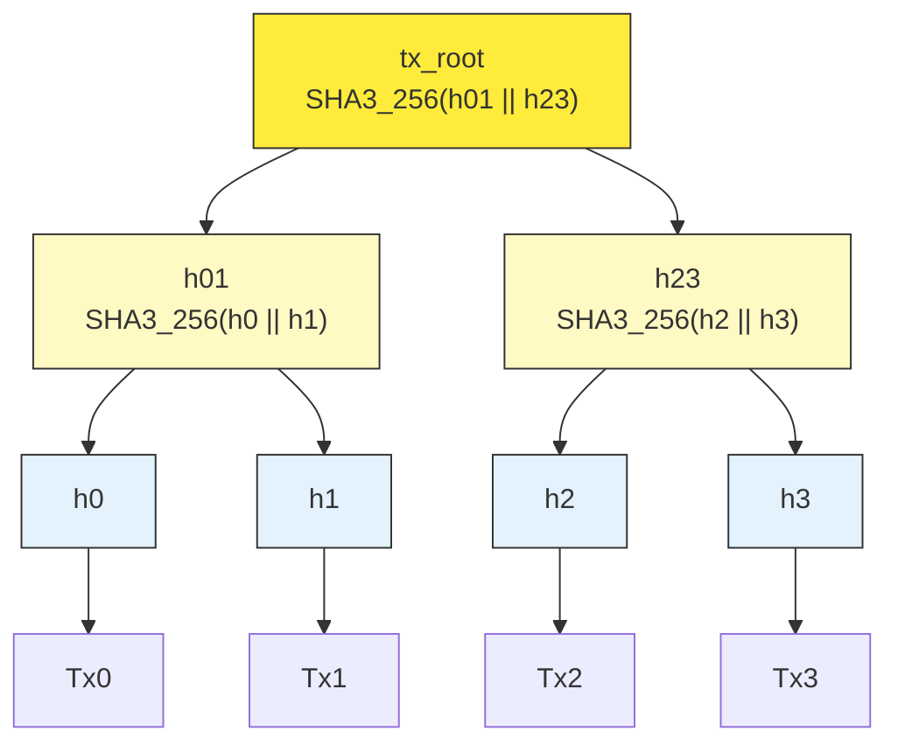

### 2.3 SmartBFT Consensus on BAFs

The **Consensus** microservice runs SmartBFT consensus on BAFs (digest-based ordering). The protocol operates in four phases across n=4 replicas tolerating f=1 Byzantine fault. The Primary Batcher-P initiates by broadcasting a PRE-PREPARE message containing the BAF. All replicas respond with PREPARE messages containing the digest and their replica ID; consensus requires 2f+1=3 matching PREPAREs. Once a replica collects 2f+1 PREPAREs, it broadcasts a COMMIT message. After receiving 2f+1 COMMITs, the BAF is decided and committed to the ledger. The entire consensus process typically completes in 100-200ms at P99.

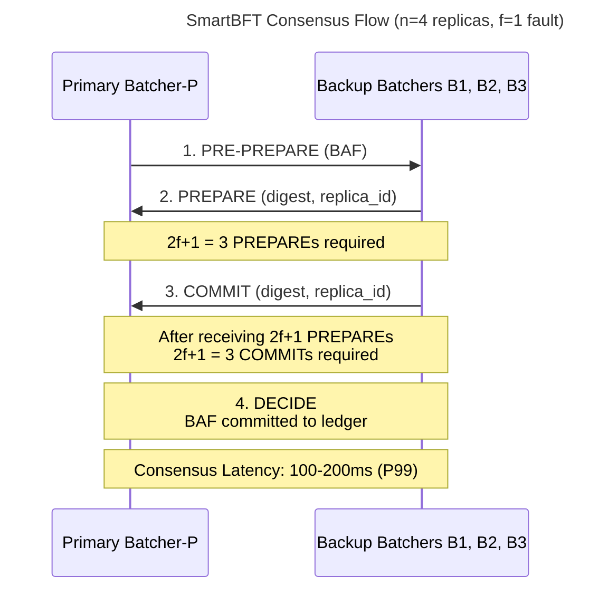

### 2.4 Block Construction and Distribution

The **Assembler** constructs blocks from committed BAFs and distributes them to peers. Each block contains three main sections. The **Block Header** includes metadata such as block number, shard ID, timestamp, previous block hash, transaction Merkle root, BAF chain root, state root (computed post-commit), proposer ID, and the consensus view number. The **Block Body** holds the actual transactions extracted from the BAFs along with the BAF attestations themselves. Finally, **Block Signatures** contain a BLS aggregate signature from the consensus replicas.

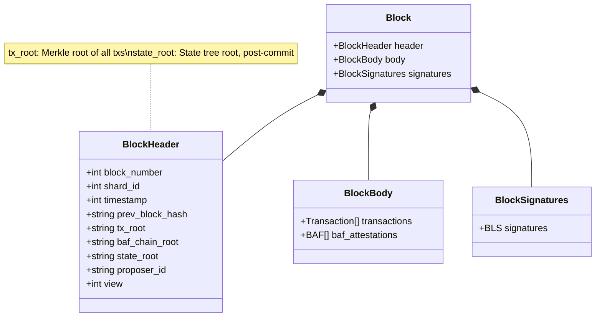

### 2.5 Timing - Ordering Phase

The ordering phase averages 112ms at P50 and 305ms at P99 per transaction. Router validation takes about 2ms for signature and nonce checks. Transactions wait in the Batcher pool for approximately 25ms until a batch threshold triggers. BAF generation including Merkle tree construction requires 5ms. SmartBFT consensus across three phases consumes 50ms at P50 (150ms at P99) due to network round-trips. Block construction and signing takes 10ms, followed by 20ms for gossip distribution to peers.

## Phase 3: Commitment

### 3.1 Block Reception and Ingestion

Peers receive blocks from the Assembler via gossip and forward to the **Committer pipeline** through **Sidecar**.

### 3.2 Dependency Graph Construction

The **Coordinator** builds a **dependency graph** to identify parallelizable transactions. Dependency tracking is **coarse-grained** at the transaction level (not fine-grained RW/WR/WW). While the system can track fine-grained dependencies, it uses coarse-grained tracking in practice for performance.

Transactions are marked as dependent if they access the same keys, regardless of read/write type. This simplifies the dependency graph and reduces overhead.

| Type | Condition | Example | Ordering |
|------|-----------|---------|----------|
| RW (Read-Write) | T₁ reads k, T₂ writes k | T₁: READ(A), T₂: WRITE(A) | T₁ → T₂ |
| WR (Write-Read) | T₁ writes k, T₂ reads k | T₁: WRITE(A), T₂: READ(A) | T₁ → T₂ |
| WW (Write-Write) | T₁ writes k, T₂ writes k | T₁: WRITE(A), T₂: WRITE(A) | T₁ → T₂ |
| RR (Read-Read) | T₁ reads k, T₂ reads k | T₁: READ(A), T₂: READ(A) | Parallel ✓ |

**Example DAG:**

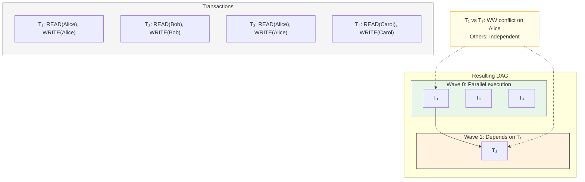

### 3.3 Parallel Validation Pipeline

Two microservices validate transactions in parallel waves. The **Verifier** handles syntax checking, signature verification, nonce validation, and **policy parsing**—it is highly parallelizable and CPU-intensive due to cryptographic operations. The **VC (Validator-Committer)** enforces VSCC policies and executes validation logic. 

> **Note:** Query Service is NOT part of the validation pipeline. It is a separate service for client state queries only.

The VC contains three internal components:
- **Preparer**: Prepares validation context and state snapshots  
- **Validator**: Executes VSCC (Validation System Chaincode) logic, checks read-write set semantic correctness
- **Committer**: Applies state changes for valid transactions

Validation executes in **parallel** across independent transactions, not sequentially.

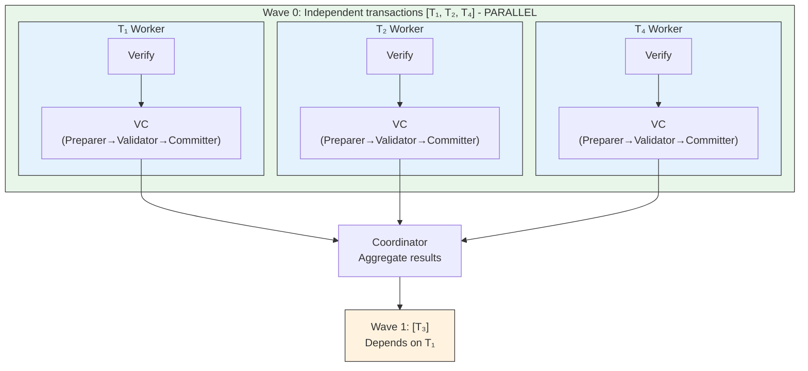

### 3.4 Validation Details

#### Verifier - Syntax, Signature, and Policy Validation

The Verifier executes a five-step validation pipeline:
1. Parse transaction envelope
2. Check format correctness  
3. **Parse endorsement policies** (extracts policy from transaction)
4. Verify cryptographic signatures against policies
5. Validate nonce (check for duplicates)

Any step failure marks the transaction INVALID.

> **Note:** The Verifier does NOT execute in the Committer pipeline. It is a separate microservice that validates signatures and policies.

#### VC (Validator-Committer) - VSCC Enforcement

The VC validates the read-write set for semantic correctness, ensuring no phantom writes exist. **BAF (Batch Attestation Fragment) is internal to Arma** and not visible to the Committer pipeline.

The VC contains three internal components:
- **Preparer**: Prepares validation context and state snapshots
- **Validator**: Executes VSCC logic, checks read-write set semantic correctness, performs MVCC conflict detection
- **Committer**: Applies state changes for valid transactions to the database

The result is either VALID or INVALID.

> **Note:** Query Service is NOT part of validation. It handles client state queries only.

#### VcTx Status Field

Each transaction in the VC has a `prelim_invalid_tx_status` field in its `VcTx` structure (defined in `api/servicepb/vcservice.proto`). This field tracks preliminary validation status before final commitment:
- `0` = preliminarily valid
- Non-zero = specific validation failure (MVCC conflict, policy violation, etc.)

### 3.5 Result Aggregation and Commit

The Coordinator aggregates validation results from all workers and instructs Sidecar to commit. The commit process involves three steps. First, the State Database is updated by applying writes from valid transactions and incrementing version numbers for modified keys. Second, the block is appended to the blockchain file, including the block header, all transactions (both valid and invalid), and their validation codes. Finally, events are emitted to notify subscribed clients about the committed block and individual transaction statuses.

### 3.6 Timing - Commitment Phase

The commitment phase completes in 68ms at P50 and 208ms at P99 per block. Block ingestion via Sidecar takes 3ms. Dependency graph construction requires 5ms. Wave 0 validation runs in parallel across Verifier and VC services in 20ms, while Wave 1 (dependent transactions) executes sequentially in another 20ms. Result aggregation takes 2ms. State DB commit with write-ahead log and apply operations consumes 10ms, followed by 5ms for blockchain file I/O. Event emission over gRPC streams adds a final 3ms.

## Complete Sequence Diagram

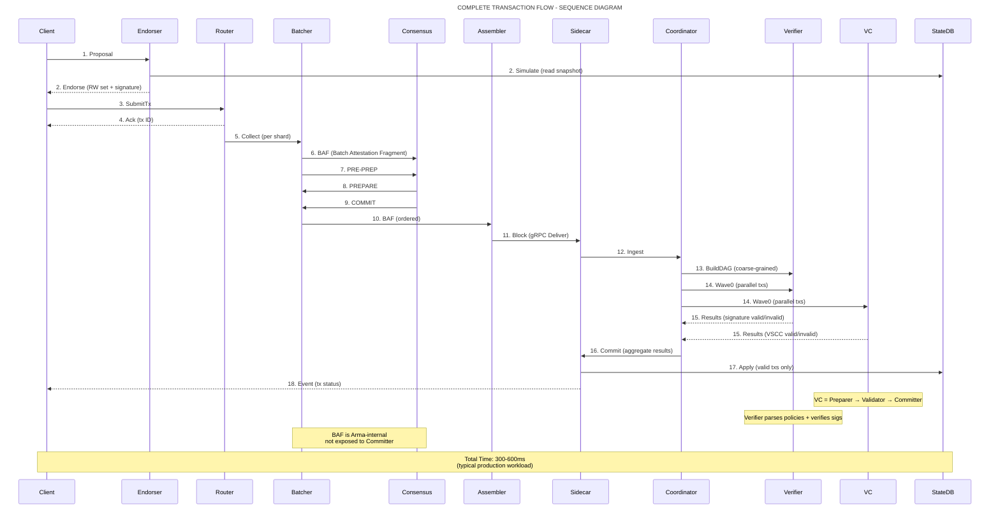

## End-to-End Timing Summary

| Phase | Component | P50 Latency | P99 Latency | % of Total |
|-------|-----------|-------------|-------------|------------|
| **Endorsement** | Client + FSC | 25ms | 100ms | 8-17% |
| **Ordering** | Arma (Router→Assembler) | 112ms | 305ms | 37-51% |
| **Commitment** | Committer Pipeline | 68ms | 208ms | 23-35% |
| **Network Overhead** | Client↔Peer | 10-50ms | 50-150ms | Variable |
| **TOTAL** | End-to-end | **215ms** | **663ms** | 100% |

## Component Interaction Summary

### Microservices Involved

| Phase | Microservice | Role | gRPC Interface |
|-------|-------------|------|----------------|
| Endorsement | FSC View / Custom Endorser | Transaction simulation | `Endorse(Proposal) → (RWSet, Signature)` |
| Ordering | Router | Tx validation, shard mapping | `SubmitTx(Tx) → Ack` |
| Ordering | Batcher | Batch formation, BAF generation | `CreateBAF(Batch) → BAF` |
| Ordering | Consensus | SmartBFT consensus on BAFs | `SubmitBAF(BAF) → ConsensusResult` |
| Ordering | Assembler | Block construction, distribution | `AddBAF(BAF) → Block` |
| Commitment | Sidecar | Block ingestion, commit | `Commit(ValidTxs) → BlockEvent` |
| Commitment | Coordinator | DAG construction, scheduling | `Schedule(Txs) → Waves` |
| Commitment | Verifier | Signature, format validation | `ValidateTx(Tx) → ValidationResult` |
| Commitment | VC | Policy, VSCC validation | `Validate(VSCCReq) → VSCCResp` |

### Communication Patterns

| Pattern | Description | Example |
|---------|-------------|---------|
| Request-Response | Synchronous gRPC call | Client → Endorser |
| Streaming | Asynchronous event stream | Sidecar → Client (block events) |
| Gossip | Peer-to-peer broadcast | Assembler → Peers (block distribution) |
| Pub-Sub | Event subscription | Client subscribes to namespace events |

## Failure Handling

### Transaction-Level Failures

| Failure Type | Detection Point | Handling | Retry? |
|--------------|-----------------|----------|--------|
| Invalid signature | Router / Verifier | Tx rejected | No (fix signature) |
| Duplicate nonce | Router | Tx rejected | No (increment nonce) |
| Insufficient endorsements | Client | Tx rejected | Yes (collect more) |
| MVCC conflict | VC service | Tx marked INVALID | Yes (resubmit) |
| Policy violation | VC service | Tx marked INVALID | No (fix policy) |
| Timeout | Any component | Tx marked INVALID | Yes (resubmit) |

### System-Level Failures

| Failure | Impact | Recovery |
|---------|--------|----------|
| Endorser crash | Cannot collect endorsements | Failover to backup endorser |
| Router crash | Tx submission blocked | Router pool failover |
| Batcher primary failure | Consensus halted | View change (elect new primary) |
| Consensus Byzantine | Consensus compromised | Complaint mechanism, view change |
| Coordinator crash | Validation halted | Restart + replay from checkpoint |
| State DB corruption | Commit failed | Restore from snapshot + replay |

## Best Practices

### For Application Developers

**Minimize Read-Write Sets** - Fewer keys means fewer conflicts and more parallelism. **Design for MVCC Conflicts** - Implement retry logic with exponential backoff since conflicts are expected under contention. **Choose Endorsement Policy Wisely** - Consider `NOutOf` policies for balanced governance without requiring all organizations. **Monitor Transaction Latency** - Track P50, P95, and P99 latencies to detect performance degradation.

### For Network Operators

**Size Arma Shards Appropriately** - Start with 4-8 shards and scale based on observed load patterns. **Configure Committer Worker Pools** - Match worker count to available CPU cores for optimal parallelization. **Enable Monitoring** - Track metrics across all microservices and set up alerts for anomalies. **Plan for Failover** - Deploy redundant microservices to handle failures without service interruption.

## References

See related documentation: [Arma Ordering Service](../orderer/docs/architecture.md), [Committer Pipeline](../committer/docs/architecture.md), [Endorsement Models](../concepts/endorser.md), [Dependency Graph and Parallel Validation](../committer/docs/coordinator.md), [SmartBFT Protocol Specification](../orderer/docs/architecture.md), and [Transaction SDK Tutorial](../tutorials/token-sdk.md).
