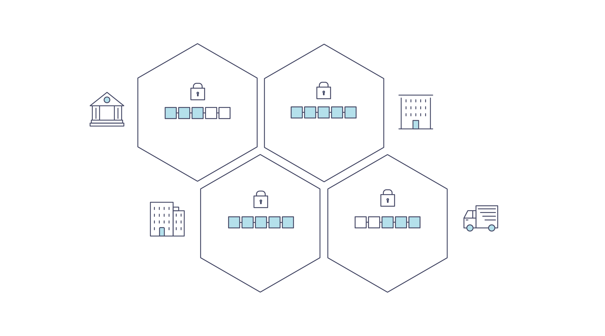
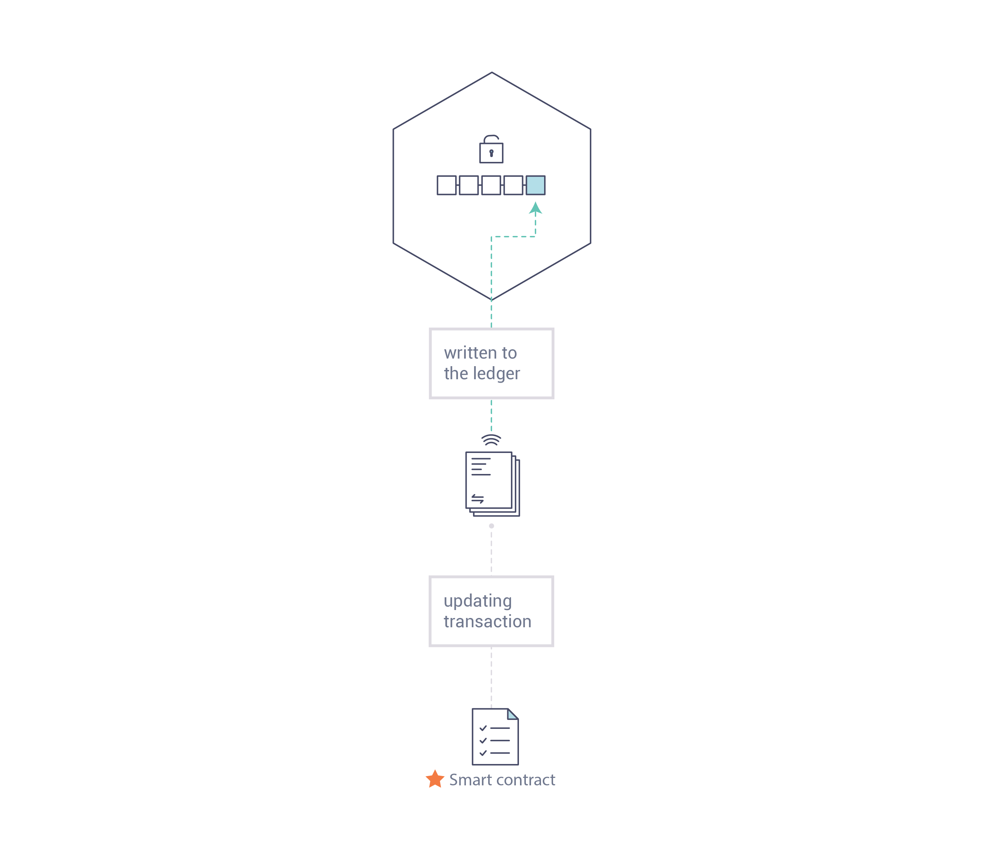
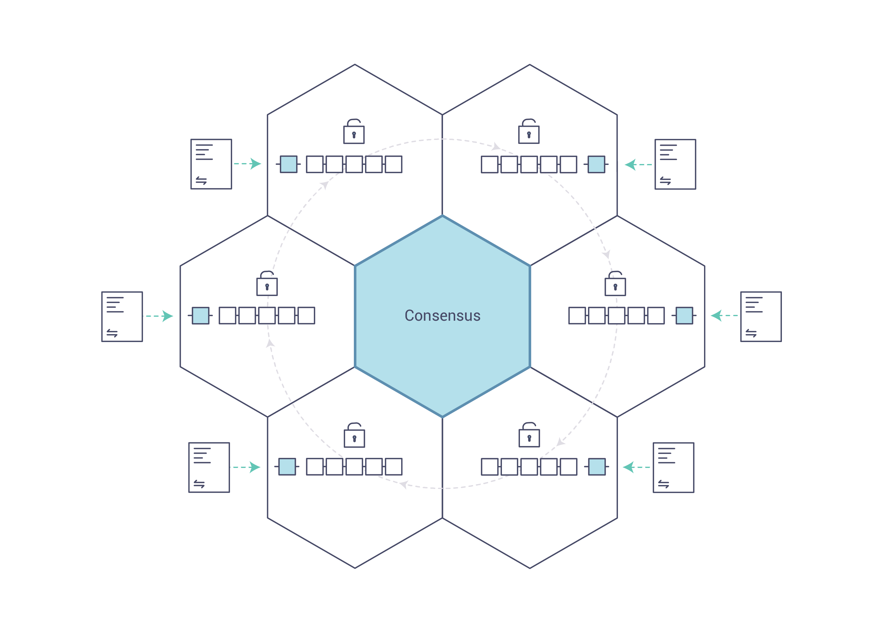
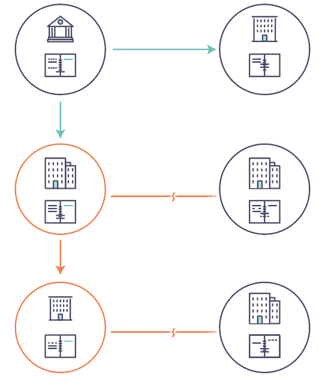
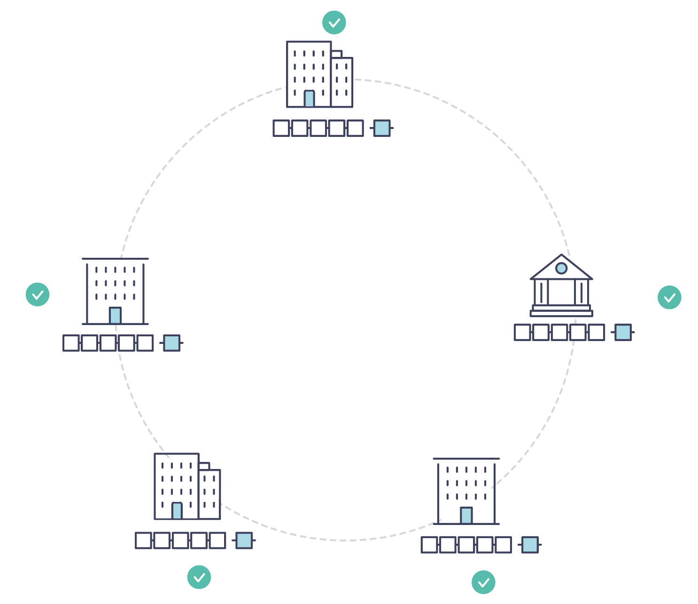

<!-- SPDX-License-Identifier: Apache-2.0 -->
# Blockchain Fundamentals

> **See Also**: Blockchain Mermaid Diagrams for visual representations of these concepts.

## What is a Blockchain?

### A Distributed Ledger

At the heart of a blockchain network is a **distributed ledger** that records all transactions occurring on the network.

A blockchain ledger is **decentralized** because it is replicated across many network participants, each of whom **collaborate** in its maintenance. Decentralization and collaboration are powerful attributes that mirror how businesses exchange goods and services in the real world.

In addition to being decentralized and collaborative, information recorded to a blockchain is **append-only**, using cryptographic techniques that guarantee once a transaction has been added to the ledger it cannot be modified. This property of **immutability** makes it simple to determine the provenance of information because participants can be sure information has not been changed after the fact. This is why blockchains are sometimes described as **systems of proof**.

### Smart Contracts

To support consistent updates of information—and to enable a whole host of ledger functions (transacting, querying, etc.)—a blockchain network uses **smart contracts** to provide controlled access to the ledger.

Smart contracts are not only a key mechanism for encapsulating information and keeping it simple across the network, they can also be written to allow participants to execute certain aspects of transactions automatically.

A smart contract can, for example, be written to stipulate the cost of shipping an item where the shipping charge changes depending on how quickly the item arrives. With the terms agreed to by both parties and written to the ledger, the appropriate funds change hands automatically when the item is received.

### Consensus

The process of keeping the ledger transactions synchronized across the network—to ensure that ledgers update only when transactions are approved by the appropriate participants, and that when ledgers do update, they update with the same transactions in the same order—is called **consensus**.

You'll learn more about ledgers, smart contracts and consensus later. For now, it's enough to think of a blockchain as a shared, replicated transaction system which is updated via smart contracts and kept consistently synchronized through a collaborative process called consensus.

## Why is a Blockchain Useful?

### Today's Systems of Record

The transactional networks of today are little more than slightly updated versions of networks that have existed since business records have been kept. The members of a **business network** transact with each other, but they maintain separate records of their transactions. And the things they're transacting—whether it's Flemish tapestries in the 16th century or the securities of today—must have their provenance established each time they're sold to ensure that the business selling an item possesses a chain of title verifying their ownership of it.

Modern technology has taken this process from stone tablets and paper folders to hard drives and cloud platforms, but the underlying structure is the same. Unified systems for managing the identity of network participants do not exist, establishing provenance is so laborious it takes days to clear securities transactions (the world volume of which is numbered in the many trillions of dollars), contracts must be signed and executed manually, and every database in the system contains unique information and therefore represents a single point of failure.

It's impossible with today's fractured approach to information and process sharing to build a system of record that spans a business network, even though the needs of visibility and trust are clear.

### The Blockchain Difference

What if, instead of the rat's nest of inefficiencies represented by the "modern" system of transactions, business networks had standard methods for establishing identity on the network, executing transactions, and storing data? What if establishing the provenance of an asset could be determined by looking through a list of transactions that, once written, cannot be changed, and can therefore be trusted?

That business network would have every participant with their own replicated copy of the ledger. In addition to ledger information being shared, the processes which update the ledger are also shared. Unlike today's systems, where a participant's **private** programs are used to update their **private** ledgers, a blockchain system has **shared** programs to update **shared** ledgers.

With the ability to coordinate their business network through a shared ledger, blockchain networks can reduce the time, cost, and risk associated with private information and processing while improving trust and visibility.

## Permissioned vs Permissionless Blockchains

### Permissionless Blockchains

Permissionless blockchains (like Bitcoin and Ethereum public networks) allow anyone to participate anonymously. Unknown identities can join the network and validate transactions. These systems require protocols like **proof of work** or **proof of stake** to validate transactions and secure the network against malicious actors.

The open nature of permissionless blockchains creates inherent limitations for enterprise use. Since participants cannot be trusted by default, these networks must rely on computationally expensive consensus mechanisms to prevent malicious behavior. This architectural requirement results in lower transaction throughput, as the network must wait for cryptographic puzzles to be solved before confirming transactions. Transaction finality also suffers from higher latency, often taking minutes or even hours to achieve certainty.

Privacy presents another significant challenge in permissionless environments. All transactions are typically visible to all participants, making it impossible to conduct confidential business dealings. The lack of identity verification means that bad actors can join the network without consequence, and there is no recourse for fraudulent activity. While this openness enables broad participation and censorship resistance, these characteristics are less valuable for enterprise scenarios than security, performance, and regulatory compliance.

### Permissioned Blockchains

Permissioned blockchains take a fundamentally different approach by restricting network participation to known, verified entities. Members enroll through a trusted **Membership Service Provider (MSP)** that manages digital identities, creating an environment where all participants are accountable for their actions. This model aligns naturally with how businesses already operate, where relationships are established through contracts and legal frameworks before transactions occur.

The verified identity model unlocks significant performance advantages. Since participants are known and accountable, consensus mechanisms do not require expensive cryptographic puzzles. Fabric-X uses SmartBFT through Arma to provide Byzantine Fault Tolerant ordering for known organizations. This supports much higher throughput and more predictable finality than proof-of-work public networks.

Privacy and governance become tractable problems in permissioned environments. In Fabric-X, privacy is implemented primarily through FSC application protocols and off-chain storage patterns rather than ledger-level channels. Sensitive business data can stay with authorized participants while the shared ledger records anchors, hashes, commitments, and agreed state transitions. Governance frameworks can be established that align with business requirements, allowing for formal decision-making processes around network upgrades, policy changes, and dispute resolution. These characteristics make permissioned blockchains particularly well-suited for enterprise and consortium use cases where accountability, performance, and confidentiality are paramount.

## Why Permissioned for Enterprise?

Fabric-X, like Hyperledger Fabric, is a **private** and **permissioned** blockchain platform. This architectural choice addresses critical enterprise requirements that permissionless blockchains simply cannot satisfy.

### Identity and Access Control

Enterprises operate in regulated environments where knowing who participates in the network is essential. Permissioned networks provide comprehensive identity management through digital certificates issued to all participants, creating an unbroken chain of accountability for every transaction. This foundation enables role-based access control, ensuring that participants can only access ledger data and smart contracts appropriate to their business function.

The audit capabilities of permissioned networks link every transaction to specific identities, creating transparent audit trails that satisfy regulatory requirements. This directly supports compliance with KYC (Know Your Customer) and AML (Anti-Money Laundering) regulations, which mandate that financial institutions verify the identity of their counterparties. In a permissioned blockchain, this verification happens at network enrollment and is cryptographically enforced throughout the transaction lifecycle.

### Performance and Scalability

Enterprise applications demand high throughput and low latency that permissionless blockchains cannot deliver. Permissioned consensus mechanisms can optimize for known participants instead of anonymous miners. Fabric-X uses Arma and SmartBFT to order compact batch attestations and support high-throughput BFT ordering without energy-intensive mining.

Sub-second finality becomes achievable for time-sensitive business processes like securities settlement, supply chain tracking, and payment processing. Performance remains predictable without the mining delays or gas price fluctuations that plague public networks. Enterprises can plan capacity and guarantee service levels, which is essential for production business applications.

### Privacy and Confidentiality

Business networks often include competitors who need to transact while protecting sensitive information. Fabric-X uses a single-channel model, so privacy is handled primarily through namespace policy, FSC application protocols, and off-chain storage patterns rather than Fabric Classic channels or private data collections.

A common pattern is to keep sensitive business data in participant-controlled systems while committing hashes, commitments, state transitions, or other verification material to the shared ledger. This preserves auditability and consistency without forcing every network participant to hold every private business field.

### Governance and Upgradability

Enterprise networks require clear governance structures and the ability to evolve over time. Permissioned blockchains support formal governance frameworks that define how network operations are managed, how decisions are made, and how disputes are resolved. This mirrors the governance structures enterprises already use in consortiums and industry associations.

Smart contract versioning and lifecycle management allow networks to upgrade business logic without disrupting ongoing operations. The pluggable architecture permits networks to swap consensus mechanisms, identity providers, and data stores as needs evolve, protecting investments and enabling adaptation to new requirements. This flexibility is impossible in permissionless networks where changes require broad consensus from anonymous participants.

### Regulatory Compliance

Industries like finance, healthcare, and supply chain operate under strict regulatory oversight that permissionless blockchains cannot accommodate. Permissioned blockchains enable data residency controls that ensure information is stored and processed in specific geographic regions to comply with local laws. When regulations require data deletion, off-chain data patterns can implement "right to be forgotten" requirements while maintaining the integrity of the blockchain audit trail.

Regulatory reporting becomes more efficient with auditable transaction histories that can be queried and exported in formats required by oversight bodies. The combination of identity verification, access controls, and comprehensive audit trails creates a compliance-ready infrastructure that reduces the cost and complexity of regulatory adherence.

## Fabric-X Architecture Overview

Fabric-X builds on these blockchain fundamentals with a modular architecture delivering high degrees of confidentiality, resiliency, flexibility, and scalability. It is designed to support pluggable implementations of different components and accommodate the complexity and intricacies that exist across the economic ecosystem.

### Shared Ledger

Fabric-X has a ledger subsystem comprising two components: the **world state** and the **transaction log**. Each participant has a copy of the ledger for every Fabric-X network they belong to.

The **world state** component describes the state of the ledger at a given point in time. It uses a key-value data model: each namespace stores keys and their current values, along with version metadata used for validation. The **transaction log** component records all transactions which have resulted in the current value of the world state; it's the update history for the world state. The ledger, then, is a combination of the key-value world state database and the transaction log history.

Fabric-X stores world state in PostgreSQL or YugabyteDB. These databases provide the durable key-value state view used by the committer pipeline. The transaction log records the ordered history of ledger updates used by the blockchain network.

### Smart Contracts (FSC Views)

Fabric-X smart contracts are implemented as **FSC (Fabric Smart Client) views** that are invoked by an application external to the blockchain when that application needs to interact with the ledger. In most cases, FSC views interact only with the database component of the ledger, the world state (querying it, for example), and not the transaction log.

> **Note:** Unlike Fabric Classic where smart contracts run as "chaincode" in Docker containers, Fabric-X uses FSC views that execute as native Go code without container overhead. This provides approximately 25x performance improvement. While legacy documentation may reference "chaincode," Fabric-X applications use FSC views implemented in Go.

### Privacy

Depending on the needs of a network, participants in a Business-to-Business (B2B) network might be extremely sensitive about how much information they share. For other networks, privacy will not be a top concern.

Fabric-X privacy is primarily implemented through FSC application protocols rather than ledger-level channels. Sensitive data can remain off-chain in participant-controlled storage, while the ledger stores anchors, hashes, commitments, or other verification material needed for auditability and consistency. Networks can therefore keep private business data outside the shared ledger while preserving on-chain proof of agreed transaction effects.

### Consensus

Transactions must be written to the ledger in a single consensus-established order, even though they might be between different sets of participants within the network. The order is not based on wall-clock timing; it is the deterministic order agreed by the ordering service. Without this agreed order, committers could apply updates differently and end with inconsistent state. A method for rejecting bad transactions that have been inserted into the ledger in error (or maliciously) must also be put into place.

This is a thoroughly researched area of computer science, and there are many ways to achieve it, each with different trade-offs. Fabric-X has been designed to allow network starters to choose a consensus mechanism that best represents the relationships that exist between participants. As with privacy, there is a spectrum of needs; from networks that are highly structured in their relationships to those that are more peer-to-peer.

## Next Steps

Now that you understand blockchain fundamentals and why permissioned blockchains are essential for enterprise use cases, you're ready to explore Fabric-X in more depth. The [Fabric-X Architecture](../architecture/index.md) documentation provides a platform overview. If you're ready to start building, start with [Installation](../getting_started/install.md) and [Run Fabric-X](../getting_started/run-fabric-x.md). For application design, see the [Fabric-X Model](fabric-x-model.md) and [Endorsement Models](endorser.md).