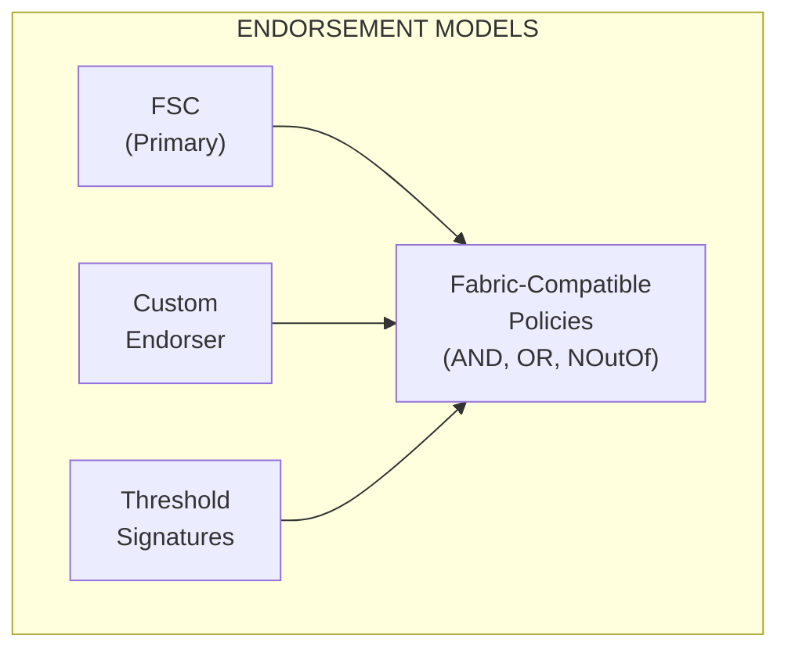
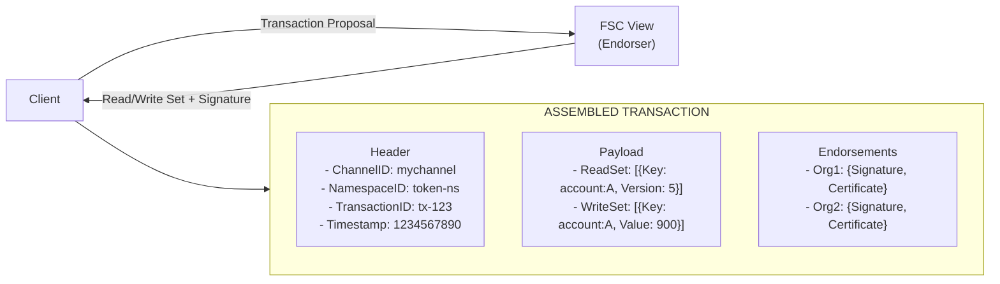
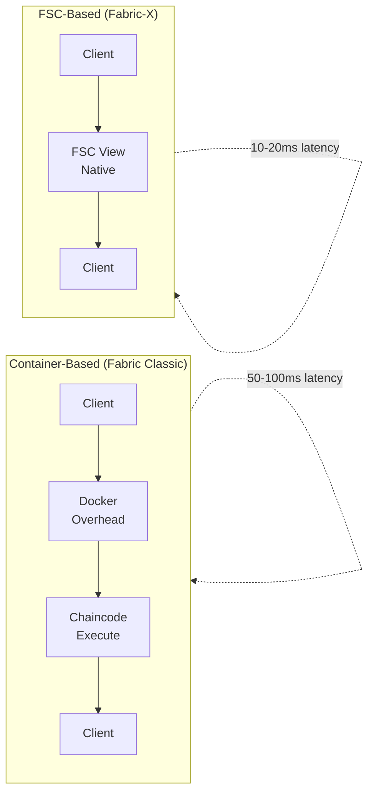
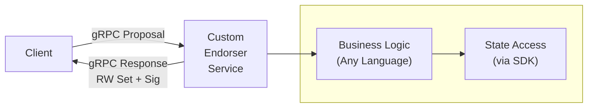
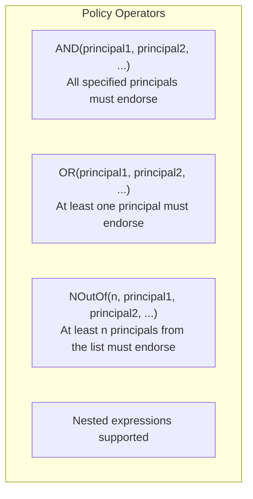
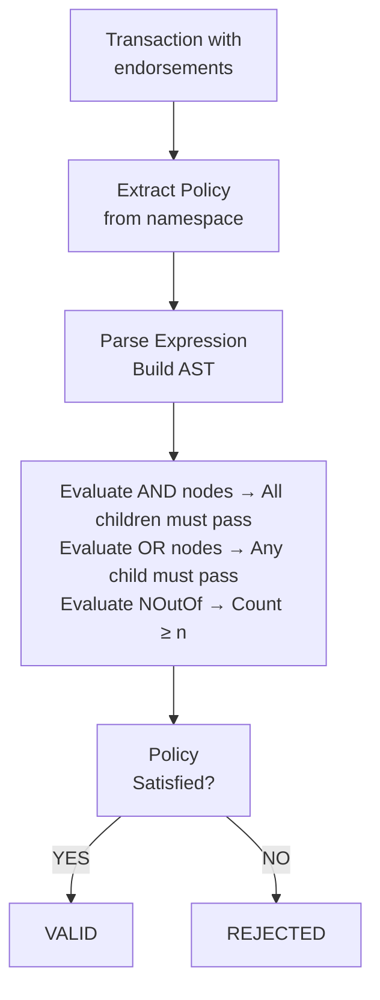
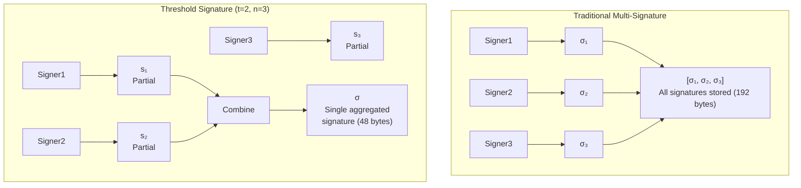
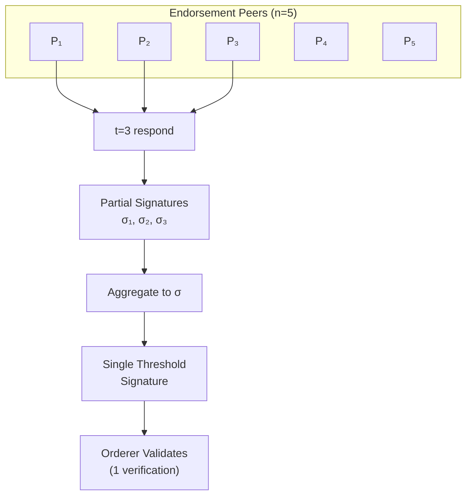
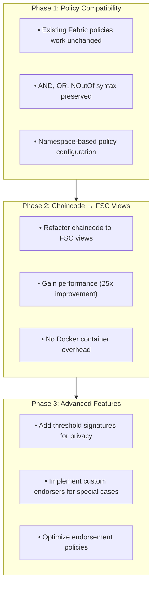

<!-- SPDX-License-Identifier: Apache-2.0 -->
# Endorsement Models in Fabric-X

## Overview

Fabric-X supports multiple endorsement models, providing flexibility for different use cases while maintaining compatibility with Hyperledger Fabric policies. This document covers the primary endorsement approaches: **FSC-based endorsement**, **custom endorsers**, **Fabric-compatible policies**, and **threshold signatures**.

The endorsement model architecture brings together three distinct approaches under a unified policy framework. FSC-based endorsement serves as the primary model for most smart contract workloads, while custom endorsers enable integration with external systems and specialized cryptographic operations. Threshold signatures provide an advanced mechanism for privacy-sensitive applications requiring signer anonymity. All three models operate within Fabric-compatible policies that support familiar AND, OR, and NOutOf operators.



## 1. FSC-Based Endorsement (Primary Model)

### Architecture

Fabric-X uses **Fabric-Smart-Client (FSC) views** as the primary endorsement mechanism. Unlike Hyperledger Fabric Classic where chaincode executes in Docker containers, FSC views run as native Go code, providing significant performance improvements.



### FSC View Structure

An FSC view implements the endorsement logic as native Go code. The view structure encapsulates transaction parameters and implements a Call method that executes the endorsement logic. This method reads the current state from the ledger, validates the transaction against business rules, computes the new state, and produces a read-write set. The view then signs this read-write set using the FSC identity framework and returns an endorsement containing the read-write set, signature, and certificate.

```go
// FSC View implementing endorsement logic
type TokenTransferView struct {
    Sender    string
    Receiver  string
    Amount    uint64
    Namespace string
}

// Call executes the view and produces read/write sets
func (v *TokenTransferView) Call(ctx view.Context) (interface{}, error) {
    // 1. Read current state
    senderBalance, err := v.readBalance(ctx, v.Sender)
    receiverBalance, err := v.readBalance(ctx, v.Receiver)
    
    // 2. Validate transaction
    if senderBalance < v.Amount {
        return nil, errors.New("insufficient funds")
    }
    
    // 3. Compute new state
    newSenderBalance := senderBalance - v.Amount
    newReceiverBalance := receiverBalance + v.Amount
    
    // 4. Create read-write set
    rwSet := &RWSet{
        Reads: []Read{
            {Key: v.accountKey(v.Sender), Version: currentVersion},
            {Key: v.accountKey(v.Receiver), Version: currentVersion},
        },
        Writes: []Write{
            {Key: v.accountKey(v.Sender), Value: newSenderBalance},
            {Key: v.accountKey(v.Receiver), Value: newReceiverBalance},
        },
    }
    
    // 5. Sign the read-write set
    signature, err := ctx.Sign(rwSet.Hash())
    
    // 6. Return endorsement
    return &Endorsement{
        RWSet:     rwSet,
        Signature: signature,
        Certificate: ctx.Certificate(),
    }, nil
}
```

FSC views exhibit several key characteristics that distinguish them from traditional chaincode. Execution occurs as native Go code without Docker container overhead, resulting in approximately 25x faster performance compared to container-based chaincode. The model supports multi-round protocols between parties, enabling interactive transaction flows that were difficult to implement in Fabric Classic. State access happens through direct read-write set manipulation, giving developers fine-grained control over ledger operations. Identity management leverages the FSC identity framework, which remains MSP-based and compatible with existing Fabric certificate structures.

The performance advantages of FSC-based endorsement become clear when comparing the endorsement flow to container-based approaches. In Fabric Classic, a client proposal must traverse Docker overhead before reaching chaincode execution, then return through the same path, typically requiring 50-100ms latency. FSC-based endorsement in Fabric-X eliminates the Docker layer entirely, allowing the client to communicate directly with the native FSC view. This streamlined path reduces latency to 10-20ms, enabling throughput of approximately 50,000 transactions per second.



## 2. Custom Endorser Services

> **⚠️ PLANNED FEATURE:** Custom endorser services through gRPC are planned but **not yet implemented** in the current release.

### Architecture

Fabric-X will support **custom endorser services** for specialized endorsement logic that may not fit the FSC view model. Custom endorsers run as independent microservices and communicate via gRPC, allowing developers to implement endorsement logic in any programming language that supports gRPC communication.

The following describes the planned implementation.

The custom endorser architecture follows a client-server model where the client sends a gRPC proposal containing the transaction payload, read set, and proposer identity. The custom endorser service processes this proposal through its business logic layer, which can be implemented in any language. The service accesses state through the Fabric-X SDK, computes the read-write set, signs the result, and returns an endorsement response containing the read-write set, signature, and certificate.



Custom endorsers serve several important use cases that extend beyond the capabilities of FSC views. Legacy integration represents one primary use case, where organizations need to connect existing systems such as mainframes or legacy databases to the Fabric-X network. Specialized cryptographic operations form another use case, particularly for applications requiring zero-knowledge proof generation or other advanced cryptographic primitives not available in the standard FSC framework. External data integration enables oracle-style functionality where price feeds, weather data, or other off-chain information sources need to be incorporated into transactions. Compliance and regulatory checks, such as AML/KYC validation, often require integration with external systems that custom endorsers can facilitate. Multi-party computation protocols for privacy-preserving analytics also benefit from the flexibility that custom endorsers provide.

### Custom Endorser Implementation

Implementing a custom endorser requires defining a gRPC service with two primary methods: Endorse for producing signed read-write sets and Simulate for testing transaction outcomes without commitment. The EndorsementRequest message carries the namespace, transaction payload, read set, optional state cache, and proposer identity. The EndorsementResponse returns a success flag, the computed read-write set, signature, certificate, and any error messages that occurred during processing.

```protobuf
// Endorser gRPC Service Definition
service Endorser {
  rpc Endorse(EndorsementRequest) returns (EndorsementResponse);
  rpc Simulate(SimulationRequest) returns (SimulationResponse);
}

message EndorsementRequest {
  string namespace = 1;
  bytes transaction_payload = 2;
  ReadSet read_set = 3;
  map<string, bytes> state_cache = 4;
  Identity proposer = 5;
}

message EndorsementResponse {
  bool success = 1;
  ReadWriteSet rw_set = 2;
  bytes signature = 3;
  bytes certificate = 4;
  string error_message = 5;
}
```

The server implementation follows a four-step process. First, the endorser validates the incoming proposal to ensure it meets all requirements. Second, it executes the business logic specific to the use case, producing a read-write set. Third, the endorser signs the hash of the read-write set using its cryptographic manager. Finally, it returns an endorsement response containing the read-write set, signature, and certificate. If any step fails, the endorser returns a response with the success flag set to false and an appropriate error message.

```go
// Custom Endorser Server Implementation
type CustomEndorserServer struct {
    pb.UnimplementedEndorserServer
    stateDB  *StateDatabase
    crypto   *CryptoManager
}

func (s *CustomEndorserServer) Endorse(
    ctx context.Context, 
    req *pb.EndorsementRequest,
) (*pb.EndorsementResponse, error) {
    
    // 1. Validate proposal
    if err := s.validateProposal(req); err != nil {
        return nil, err
    }
    
    // 2. Execute business logic
    rwSet, err := s.executeLogic(req)
    if err != nil {
        return &pb.EndorsementResponse{
            Success: false,
            ErrorMessage: err.Error(),
        }, nil
    }
    
    // 3. Sign the result
    signature, err := s.crypto.Sign(rwSet.Hash())
    
    // 4. Return endorsement
    return &pb.EndorsementResponse{
        Success: true,
        RwSet: rwSet,
        Signature: signature,
        Certificate: s.crypto.Certificate(),
    }, nil
}
```

Registering custom endorsers requires configuration that specifies the endorser name, type, endpoint, and the namespaces it serves. Each endorser can be configured with TLS settings for secure communication, including certificate paths. Timeout values can be set to handle slow-running endorsers appropriately. Multiple endorsers can be registered to serve different namespaces or provide redundancy for critical endorsement paths.

```yaml
#Configuration: endorser-config.yaml
endorsers:
  - name: "compliance-endorser"
    type: "custom"
    endpoint: "compliance.fabric-x.svc:7052"
    namespaces:
      - "tokens"
      - "assets"
    tls:
      enabled: true
      cert: "/etc/ssl/compliance.crt"
      
  - name: "oracle-endorser"
    type: "custom"
    endpoint: "oracle.fabric-x.svc:7053"
    namespaces:
      - "market-data"
    timeout: 5s
```

## 3. Fabric-Compatible Endorsement Policies

### Policy Syntax

Fabric-X maintains compatibility with Hyperledger Fabric endorsement policy syntax, enabling migration of existing policies without modification. The policy language supports three fundamental operators that can be combined to express complex endorsement requirements. The AND operator requires all specified principals to endorse the transaction, ensuring unanimous agreement among the designated parties. The OR operator requires at least one principal from the list to endorse, providing flexibility in who can validate a transaction. The NOutOf operator specifies that at least n principals from a list must endorse, enabling majority or threshold-based approval schemes. These operators can be nested arbitrarily to express sophisticated endorsement logic that mirrors organizational governance structures.



### Principal Format

Principals follow a simple syntax consisting of a namespace and role separated by a dot. The namespace identifies the organizational or functional context, while the role specifies the type of identity within that namespace. Common roles include member for any member of the namespace, admin for administrative identities, peer for peer nodes, client for client applications, and validator for endorsing validators. This format provides a clear and consistent way to reference identities across the network.

```
Principal Syntax:
  <namespace>.<role>
  
Common Roles:
  member   - Any member of the namespace
  admin    - Administrative identities
  peer     - Peer nodes
  client   - Client applications
  validator - Endorsing validators
```

### Policy Examples

Simple policies demonstrate the basic operators in straightforward scenarios. A policy allowing any organization to endorse uses the OR operator across organizational members. A policy requiring all organizations to endorse uses the AND operator. A majority endorsement policy, such as requiring 2 out of 3 organizations, uses the NOutOf operator to specify the threshold.

```
#Any organization can endorse
OR(Org1.member, Org2.member, Org3.member)

#All organizations must endorse
AND(Org1.member, Org2.member, Org3.member)

#Majority endorsement (2 out of 3)
NOutOf(2, Org1.member, Org2.member, Org3.member)
```

Complex nested policies enable sophisticated governance structures that reflect real-world organizational requirements. A consortium with regulatory oversight might require endorsement from both a banking participant and a regulatory body, expressed as an AND of two OR clauses. Geographic distribution requirements can ensure that transactions receive approval from multiple regions while also requiring compliance officer sign-off. Escalation policies provide alternative approval paths, such as requiring both a manager and approver under normal circumstances, but allowing an executive to approve independently when needed.

```
#Consortium with regulatory oversight
AND(
  OR(Bank1.member, Bank2.member, Bank3.member),
  OR(Regulator.member, Auditor.member)
)

#Geographic distribution requirement
AND(
  NOutOf(2, RegionUS.member, RegionEU.member, RegionAsia.member),
  OR(ComplianceOfficer.member, RiskOfficer.member)
)

#Escalation policy
OR(
  AND(Manager.member, Approver.member),
  Executive.member
)
```

Policy evaluation follows a systematic flow that processes transactions against the configured endorsement policy. The evaluation begins by extracting the policy from the namespace configuration and parsing the expression into an abstract syntax tree. The evaluator then traverses the tree, processing AND nodes by requiring all children to pass, OR nodes by requiring any child to pass, and NOutOf nodes by counting successful evaluations against the threshold. The final determination indicates whether the policy is satisfied, resulting in either a valid or rejected transaction status.



Policy configuration occurs within the namespace definition, where the endorsement policy is specified alongside read, write, and admin policies. The endorsement policy defines who must endorse transactions, while the read and write policies control access to state. The admin policy governs administrative operations on the namespace. Policies can reference roles within the same namespace or external organizational identities, providing flexibility in access control design.

```yaml
#Namespace configuration with endorsement policy
namespace: token-ns
  version: 1
  endorsement_policy: >
    AND(
      Org1.validator,
      NOutOf(2, Org2.member, Org3.member, Org4.member)
    )
  read_policy: OR(token-ns.reader, token-ns.admin)
  write_policy: AND(token-ns.owner, token-ns.admin)
  admin_policy: token-ns.superadmin
```

## 4. Threshold Signatures

### Overview

Fabric-X supports **threshold signatures** as an advanced endorsement mechanism. Threshold signatures enable a group of signers to collectively produce a single signature, where any `t` out of `n` participants can generate a valid signature. This approach differs fundamentally from traditional multi-signature schemes, where each signer produces an independent signature that must all be stored and verified separately.

For detailed threshold signature documentation, see [threshold-signatures.md](threshold-signatures.md).

The distinction between threshold signatures and traditional multi-signature schemes has significant implications for storage efficiency and verification performance. In a traditional multi-signature scheme, each of the three signers produces an independent signature, and all three signatures must be stored on the ledger, consuming 192 bytes total. With threshold signatures using a t-of-n scheme such as 2-out-of-3, each signer produces a partial signature. These partial signatures are then combined mathematically into a single aggregated signature of just 48 bytes. This aggregated signature verifies against the combined public key of all participants, providing the same security guarantees with substantially reduced storage requirements.



### BLS Signature Aggregation

Fabric-X uses **BLS (Boneh-Lynn-Shacham)** signatures for threshold operations. BLS signatures possess several properties that make them ideal for threshold endorsement scenarios. The linear aggregation property allows multiple signatures to be mathematically summed into a single signature. This aggregated signature maintains a constant size of 48 bytes regardless of the number of signers involved. Verification requires only a single pairing operation, providing fast validation even when many signers participate. Perhaps most importantly for certain use cases, BLS signatures provide signer privacy since the aggregated signature does not reveal which specific signers contributed their partial signatures.

| Property | Benefit |
|----------|---------|
| **Linear Aggregation** | Multiple signatures sum to single signature |
| **Constant Size** | 48 bytes regardless of number of signers |
| **Fast Verification** | Single pairing operation |
| **Signer Privacy** | Individual signers not revealed |

The threshold endorsement flow demonstrates how partial signatures from multiple peers combine into a single verifiable signature. In a scenario with five endorsing peers where three signatures are required, any three peers can respond with their partial signatures. These partial signatures are then aggregated into a single threshold signature. The orderer validates this single signature with one verification operation, rather than verifying multiple independent signatures. This approach reduces both computational overhead and block size, improving overall network efficiency.



Configuration of threshold endorsement requires specifying the total number of endorsing peers, the required threshold, the cryptographic curve, and the public key shares for each participant. The BLS12-381 curve provides the mathematical foundation for the threshold signature scheme, offering strong security with efficient computation.

```yaml
endorsement:
  type: threshold
  parameters:
    n: 5          # Total endorsing peers
    t: 3          # Required threshold
    curve: BLS12-381
    key_shares:
      - pk_share_1
      - pk_share_2
      - pk_share_3
      - pk_share_4
      - pk_share_5
```

## Comparison of Endorsement Models

### Feature Comparison

The three endorsement models differ significantly across several dimensions. FSC-based endorsement implements logic as native Go code, delivering very high performance at approximately 50,000 transactions per second with standard ECDSA signature sizes. Custom endorsers offer the most flexibility by supporting any language that can communicate via gRPC, though performance depends on the specific implementation and typically reaches around 10,000 TPS. Threshold signatures use specialized cryptographic libraries to provide signer anonymity and constant-size 48-byte BLS signatures, achieving high performance around 40,000 TPS with constant-time verification regardless of the number of signers.

In terms of complexity, FSC-based endorsement presents the lowest barrier to entry for developers familiar with Go. Custom endorsers introduce medium complexity due to the need to manage gRPC communication and potentially integrate with external systems. Threshold signatures carry the highest complexity because of the cryptographic key management and aggregation logic required. Each model serves distinct use cases: FSC-based endorsement works well for general smart contracts, custom endorsers excel at legacy integration and oracle scenarios, and threshold signatures address privacy-sensitive and high-scale applications.

### Performance Comparison

Performance characteristics vary considerably across the endorsement models. FSC-based endorsement achieves the lowest latency at 10-20ms and the highest throughput at approximately 50,000 TPS. Custom endorsers exhibit higher latency ranging from 20-100ms depending on the business logic complexity, with throughput around 10,000 TPS. Threshold signatures fall in between with 15-30ms latency and 40,000 TPS throughput, but offer the advantage of constant-time signature verification regardless of participant count. Fabric Classic, by comparison, shows 50-100ms latency and only 2,000 TPS throughput due to container overhead.

Signature verification costs also differ meaningfully. Both FSC-based and custom endorsers require O(1) verification per signature, meaning verification time scales linearly with the number of endorsements. Threshold signatures achieve O(1) total verification time since all partial signatures aggregate into a single signature. This difference impacts block size as well: FSC-based and custom endorsers produce standard block sizes, while threshold signatures reduce block size through aggregated signatures. Fabric Classic blocks tend to be larger due to the need to store multiple independent signatures.

### Use Case Recommendations

Different application domains benefit from different endorsement models. Token transfer and supply chain applications typically favor FSC-based endorsement due to its high performance and native integration capabilities. Central Bank Digital Currency (CBDC) implementations often choose threshold signatures for their privacy properties and regulatory compliance features. Legacy integration scenarios naturally align with custom endorsers that can connect to existing systems. Oracle data feeds also suit custom endorsers that can access external data sources.

Consortium voting applications benefit from threshold signatures because they provide signer privacy while maintaining efficient verification. Cross-border payment systems may employ a hybrid approach combining FSC-based endorsement for performance with threshold signatures for privacy in sensitive operations. Healthcare record systems typically require threshold signatures to meet stringent privacy requirements while ensuring that authorized parties can access information.

### Migration Path from Fabric Classic

Organizations migrating from Hyperledger Fabric Classic to Fabric-X can follow a phased approach that minimizes disruption while progressively realizing benefits. The first phase focuses on policy compatibility, where existing Fabric policies continue to work unchanged. The AND, OR, and NOutOf syntax remains preserved, and organizations can adopt namespace-based policy configuration without modifying their endorsement logic.

The second phase involves refactoring chaincode to FSC views. This step delivers substantial performance improvements of approximately 25x by eliminating Docker container overhead. Organizations can realize immediate benefits from reduced latency and increased throughput while maintaining the same business logic.

The third phase introduces advanced features that were not practical in Fabric Classic. Organizations can add threshold signatures for privacy-sensitive operations, implement custom endorsers for special cases requiring external integration, and optimize endorsement policies to better reflect their governance structures. This phased approach allows organizations to migrate incrementally while testing and validating each step before proceeding.



## Best Practices

### Endorsement Policy Design

Designing effective endorsement policies requires balancing security requirements against performance constraints. Policies that require unanimous agreement from all organizations create single points of failure where any unavailable organization can halt transaction processing. A better approach uses NOutOf operators to establish threshold requirements, such as requiring 3 out of 5 organizations to endorse, providing a 60% threshold that tolerates up to two organizations being unavailable.

Geographic distribution considerations help ensure resilience against regional outages. Policies can require endorsement from multiple geographic regions by combining OR operators within regions and AND operators across regions. This approach ensures that no single regional disruption can prevent transaction processing while maintaining appropriate governance controls.

Failover planning provides alternative approval paths when primary endorsers are unavailable. Policies can specify a primary path requiring endorsement from core organizations, with an escalation path allowing backup organizations to endorse if the primary path cannot be satisfied. This approach maintains business continuity during planned maintenance or unexpected outages.

```
Good:  NOutOf(3, Org1, Org2, Org3, Org4, Org5)  # 60% threshold
Avoid: AND(Org1, Org2, Org3, Org4, Org5)       # Single point of failure
```

```
AND(
  OR(RegionUS.member, RegionCA.member),
  OR(RegionEU.member, RegionUK.member),
  OR(RegionAsia.member, RegionAU.member)
)
```

```
#Primary path + escalation
OR(
  NOutOf(3, PrimaryOrgs...),
  NOutOf(2, BackupOrgs...)
)
```

### FSC View Development

Efficient FSC view development focuses on minimizing state access overhead, validating inputs early, and handling concurrency appropriately. State reads represent one of the most expensive operations in view execution, so batching multiple reads together significantly improves performance compared to individual read operations. The context provides batch read capabilities that should be used whenever multiple keys need to be accessed.

Input validation should occur before any expensive operations to avoid wasting computational resources on invalid transactions. Simple checks for negative amounts, empty identifiers, or invalid states should happen at the beginning of the view execution. This approach provides fast failure for invalid transactions and clearer error messages for callers.

Concurrency handling requires optimistic concurrency control to detect when state has changed between read and write operations. Views should check that the version of read state matches the current version before committing writes. If a version mismatch occurs, the view should fail with an appropriate error, allowing the client to retry with fresh state.

```go
// Good: Batch reads
balances := ctx.BatchRead(keys)

// Avoid: Multiple individual reads
for _, key := range keys {
    balance := ctx.Read(key)  // Slower
}
```

```go
// Check inputs before expensive operations
if amount <= 0 {
    return nil, errors.New("invalid amount")
}
```

```go
// Use optimistic concurrency control
if readVersion != currentVersion {
    return nil, errors.New("version mismatch")
}
```

### Custom Endorser Deployment

Deploying custom endorsers in production requires careful attention to retry logic, health monitoring, and secure communication. Transient failures occur in distributed systems, and endorsers should implement exponential backoff retry strategies to handle temporary network issues or resource contention. The retry logic should attempt the operation multiple times with increasing delays between attempts, giving the system time to recover from transient conditions.

Health monitoring enables operators to detect and respond to endorser failures quickly. Custom endorsers should expose health check endpoints that report on the service status, resource utilization, and connectivity to dependent systems. Configuration should specify the health check endpoint, polling interval, and timeout values appropriate for the deployment environment.

Secure communication between clients and custom endorsers protects sensitive transaction data and prevents unauthorized access. TLS should be enabled with mutual authentication, requiring both the client and server to present valid certificates. Configuration includes certificate paths for the endorser's certificate and private key, as well as the CA certificate used to validate client certificates.

```go
// Exponential backoff for transient failures
for i := 0; i < maxRetries; i++ {
    resp, err := endorser.Endorse(ctx, req)
    if err == nil {
        return resp
    }
    time.Sleep(time.Duration(i*i) * 100ms)
}
```

```yaml
health_check:
  endpoint: "/health"
  interval: 10s
  timeout: 5s
```

```yaml
tls:
  enabled: true
  mutual_auth: true
  cert_file: "/etc/ssl/endorser.crt"
  key_file: "/etc/ssl/endorser.key"
  ca_file: "/etc/ssl/ca.crt"
```

## Troubleshooting

### Common Issues

Several common issues arise during endorsement operations, each with characteristic symptoms and resolutions. Insufficient endorsements typically indicate that the endorsement policy is too restrictive for the current set of available endorsers. Adjusting the NOutOf threshold to require fewer endorsements or ensuring that more endorsers are online can resolve this issue.

Endorsement timeouts often stem from slow custom endorser services that exceed the configured timeout window. Increasing the timeout value provides more time for complex business logic to execute, though optimizing the endorser logic itself provides a more sustainable solution. Signature verification failures usually indicate expired MSP certificates that need renewal through the certificate authority.

Policy evaluation errors result from syntax errors in the policy expression, such as mismatched parentheses or invalid principal names. Validating the policy expression using offline testing tools before deployment catches these errors early. Read-write set mismatches occur when state changes between the read and endorsement phases, indicating that another transaction modified the same keys. The client should retry the transaction with fresh state reads to resolve this condition.

### Debugging Tips

Effective debugging of endorsement issues requires appropriate logging, offline policy testing, and metrics monitoring. Enabling debug-level logging for the endorsement subsystem provides detailed information about the endorsement flow, including which principals have endorsed and how the policy evaluation proceeds. Policy logging at info level tracks policy evaluation outcomes without excessive detail.

Testing policies offline before deployment helps identify syntax errors and logical issues without affecting production transactions. The policy-test command validates that a given set of endorsements satisfies a policy expression, allowing developers to verify policy behavior in isolation.

Monitoring endorsement metrics provides visibility into the health and performance of the endorsement system. Key metrics include endorsement duration, which tracks how long endorsements take; success counts, which indicate the volume of successful endorsements; and failure counts, which highlight problems requiring investigation. These metrics should be collected per namespace to identify issues affecting specific applications or business domains.

```yaml
logging:
  endorsement: debug
  policy: info
```

```bash
fabric-x policy-test --policy "AND(Org1, Org2)" --endorsements Org1,Org2
```

```
endorsement_duration_seconds{namespace="tokens"}
endorsement_success_total{namespace="tokens"}
endorsement_failures_total{namespace="tokens"}
```

## References

- [Fabric-Smart-Client Documentation](https://github.com/hyperledger-labs/fabric-smart-client)
- [Fabric-Token-SDK](https://github.com/hyperledger-labs/fabric-token-sdk)
- [Threshold Signatures in Fabric-X](threshold-signatures.md)
- [Policies and Access Control](policies/policies.md)
- [Fabric-X Transaction Model](fabric-x-model.md)
- [BLS12-381 Curve Specification](https://hackmd.io/@benjaminion/bls12-381)