<!-- SPDX-License-Identifier: Apache-2.0 -->
# How Fabric-X networks are formed

Fabric-X networks form through shared governance, trusted identities, and coordinated runtime components. This topic focuses on two kinds of member organizations:

- **Application organizations**, which own applications, users, endorsers, committers, and application data responsibilities.
- **Orderer organizations**, which own ordering nodes that operate the ordering service.

After reading this topic, you should understand how organizations prepare identities, agree on channel configuration, start nodes, transact, add a new member, and remove an existing member.

The emphasis is on structure and intent rather than command syntax. Fabric-X networks are built from agreements between organizations, and those agreements are encoded as configuration. The physical nodes can start, stop, scale, or move, but their authority comes from the configuration and identity material that the member organizations approve.

A useful way to read this topic is to separate three layers: the **governance layer** made of organizations and policies, the **identity layer** made of CAs and MSPs, and the **runtime layer** made of applications, endorsers, orderers, committers, and ledgers. Most network operations change one layer first and then cause controlled changes in the others.

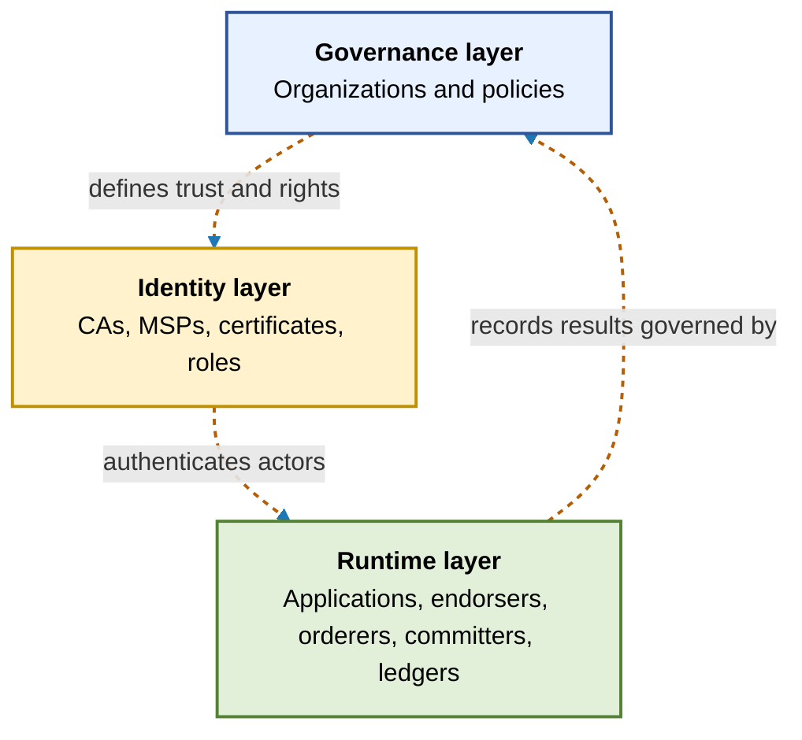

## Diagram conventions

The diagrams use different shapes and colors for different kinds of things. This keeps governance entities separate from runtime components. The goal is to make it clear whether a box represents a running process, an administrative group, a certificate-based identity, or a configuration artifact.

Some diagrams place several boxes inside a larger labeled area. That larger area represents an ownership or administrative boundary. For example, an application organization boundary can contain an application, endorser, and committer. Those runtime components are separate processes, but they are administered by the same organization and use identities issued by that organization.

- **Large rectangles** are organizations or organization groups.
- **Rounded boxes** are runtime components, such as applications, endorsers, committers, and orderers.
- **Parallelograms** are identities or MSP-related trust material.
- **Hexagons** are channel configuration or policy artifacts.
- **Cylinders** are ledgers or persisted block history.
- **Solid blue arrows** show transaction, block, or startup flow.
- **Dotted orange arrows** show governance: configuration controls or verifies something.

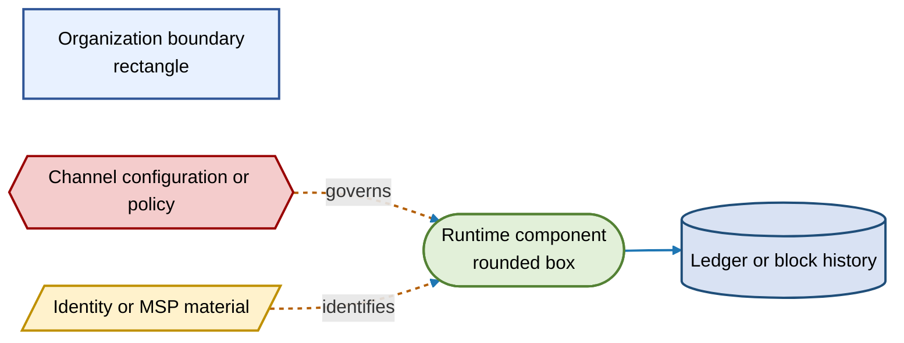

## What is a Fabric-X network?

A Fabric-X network is a governed collaboration space where organizations share one ledger and one set of policies. Fabric-X has a single-channel model, so **network** and **channel** usually refer to the same administrative scope: one ledger, one channel configuration, one set of member organizations, and one transaction path.

The network is not defined only by which machines are running. It is defined by the channel configuration that those machines trust. If a node has certificates but its organization is not listed in channel configuration, that node is not an authorized channel participant. If an organization is listed but has not started its nodes, it is a member by policy but not yet contributing runtime capacity.

This separation is important when reasoning about operations. Creating a network begins with agreement and configuration. Operating a network requires running components. Evolving a network requires changing configuration first, then bringing runtime components into alignment with the new configuration.

At runtime, applications do not update the ledger directly. An application first obtains endorsement, then submits the endorsed transaction to the ordering service. Orderers produce ordered blocks. Committers validate the ordered transactions and update ledger state. Channel configuration sits beside this runtime path and governs which identities and organizations are allowed to perform each step.

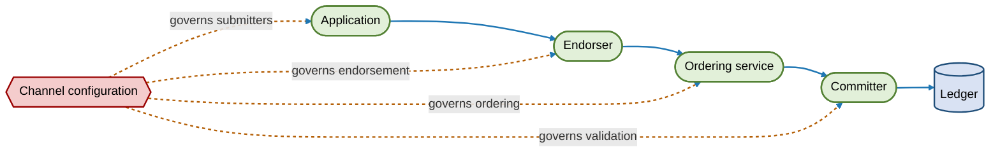

This diagram separates the **data path** from the **governance path**. Solid arrows are the transaction and block flow. Dotted arrows show channel configuration deciding whether the component or identity is authorized.

## Two kinds of organizations

Fabric-X separates network responsibilities into application organizations and orderer organizations. One legal entity can operate both kinds of infrastructure, but conceptually the roles are distinct.

This distinction helps administrators reason about authority. Application organizations are usually concerned with business participation: who can submit work, who can endorse outcomes, and who maintains application state. Orderer organizations are concerned with neutral ordering infrastructure: who participates in block production, how orderer nodes discover each other, and how ordering-service membership changes.

The distinction also helps scale governance. A new business participant may need application organization membership without operating orderer nodes. A new infrastructure operator may need orderer organization membership without submitting application transactions. Some deployments combine these roles, but the channel configuration still records which identities are valid for which roles.

Application organizations contain application-side runtime components: client applications, endorsers, and committers. Orderer organizations contain ordering nodes. Both kinds of organizations contribute public MSP definitions and are governed by the same channel configuration.

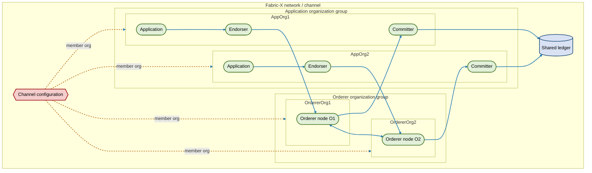

Read this diagram from left to right inside each group. Application organizations hold the components that touch application logic and ledger state. Orderer organizations hold the orderer nodes that create total order. The channel configuration connects both groups into one governed network.

### Application organizations

An application organization represents a business participant. It owns the identities and components that submit, endorse, validate, and commit application transactions.

The organization boundary matters because it is the unit that policies refer to. A policy normally does not say that a specific process can endorse forever. Instead, it says that an identity from a particular organization, with a particular role, can satisfy some part of the policy. This allows an organization to rotate nodes and certificates while preserving the same governance meaning.

For example, an endorsement policy can require signatures from application organizations rather than from named endorser processes:

```yaml
Endorsement:
  Type: Signature
  Rule: "AND('AppOrg1.peer', 'AppOrg2.peer')"
```

In this example, any valid peer-role identity from `AppOrg1` and any valid peer-role identity from `AppOrg2` can satisfy the policy. If `AppOrg1` replaces endorser `E1` with `E1b`, the policy meaning stays the same as long as `E1b` has a valid `AppOrg1` peer identity.

Application organizations also provide isolation between business participants. Each organization controls its own administrators, users, node credentials, deployment practices, and operational procedures. The channel only needs the public trust material and policy statements needed to verify that those private operations produce valid identities and signatures.

An application organization typically owns:

- Client applications and application users.
- Endorsers or peer-like nodes that execute endorsement logic.
- Committers that validate ordered blocks and update ledger state.
- An organization MSP that defines which certificates belong to the organization.
- Policies that describe what its admins, clients, and nodes may do.

In crypto configuration terms, these organizations are commonly modeled with `PeerOrgs`. The name comes from Fabric MSP role naming: peer certificates identify application-side nodes. In Fabric-X docs, think of `PeerOrgs` as application organizations.

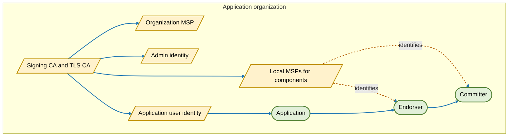

The key point is containment: an application organization is more than a business name in policy. It also contains runtime components. Its endorser executes endorsement logic. Its committer keeps a validated ledger copy. Its applications and users sign requests using identities issued under the organization's trust root.

### Orderer organizations

An orderer organization operates one or more orderer nodes. These nodes receive endorsed transactions, participate in ordering, produce blocks, and make ordered blocks available to committers.

Ordering is deliberately separated from endorsement and validation. Endorsers decide whether a proposed transaction result is acceptable under application rules. Orderers do not need to re-execute application logic; they establish a common order for endorsed transactions. Committers then validate ordered transactions against policy and state before writing them to the ledger.

Because orderer nodes affect availability and final transaction order, orderer organization membership is usually treated as infrastructure governance. Adding or removing an orderer organization can change the operational fault model of the network, so it requires careful policy approval and rollout coordination.

An orderer organization typically owns:

- One or more orderer nodes.
- Admin identities for ordering-service administration.
- An organization MSP that identifies its orderer nodes and admins.
- TLS material used by ordering nodes for secure communication.

In crypto configuration terms, these organizations are modeled with `OrdererOrgs`.

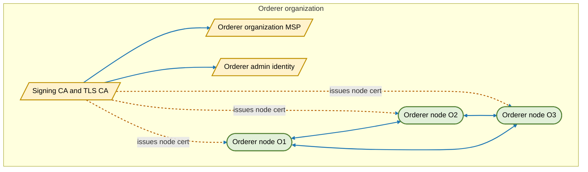

This diagram separates **organization** and **node**. The organization is the governance member named in channel configuration. Orderer nodes are runtime processes operated by that organization. A simple deployment may have one orderer node per organization; larger deployments can run multiple orderer nodes under the same organization.

### Mixed-role organizations

Some deployments use one organization to operate both application-side nodes and ordering nodes. At high level, this is still a combination of the two conceptual roles. In crypto configuration, `GenericOrgs` can represent custom or mixed layouts where individual node certificates declare their role, such as `peer` or `orderer`.

Mixed-role organizations are useful when the administrative trust boundary is shared but node roles differ. For example, a consortium service provider might operate application-side components for one function and ordering components for another. The important concept is that each certificate still carries role information, and policies still decide which role is acceptable for each action.

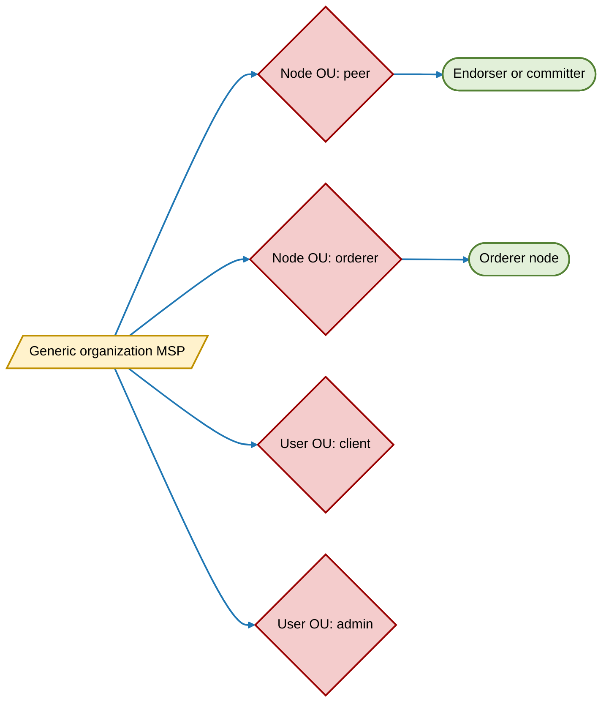

## Sample network

The sample network has two application organizations and three orderer organizations. It is intentionally small enough to follow, but it shows the main separation of duties used by larger production networks.

In this sample, application organizations are where business activity enters the network. They own the applications that create transaction proposals and the application-side nodes that endorse and commit. Orderer organizations form a shared ordering service that both application organizations use. The ordering service is not owned by either application organization alone; it is governed through channel configuration.

- `AppOrg1` runs application `A1`, endorser `E1`, and committer `C1`.
- `AppOrg2` runs application `A2`, endorser `E2`, and committer `C2`.
- `OrdererOrg1`, `OrdererOrg2`, and `OrdererOrg3` each operate an orderer node.
- All organizations are named in channel configuration `CC1`.
- Committers hold copies of ledger `L1`.

The diagram shows three layers. The top governance artifact is `CC1`. Application organizations contain their application-side components. Orderer organizations contain orderer nodes. The ledger is shown separately because it is logically owned by the channel, even though committers store local copies.

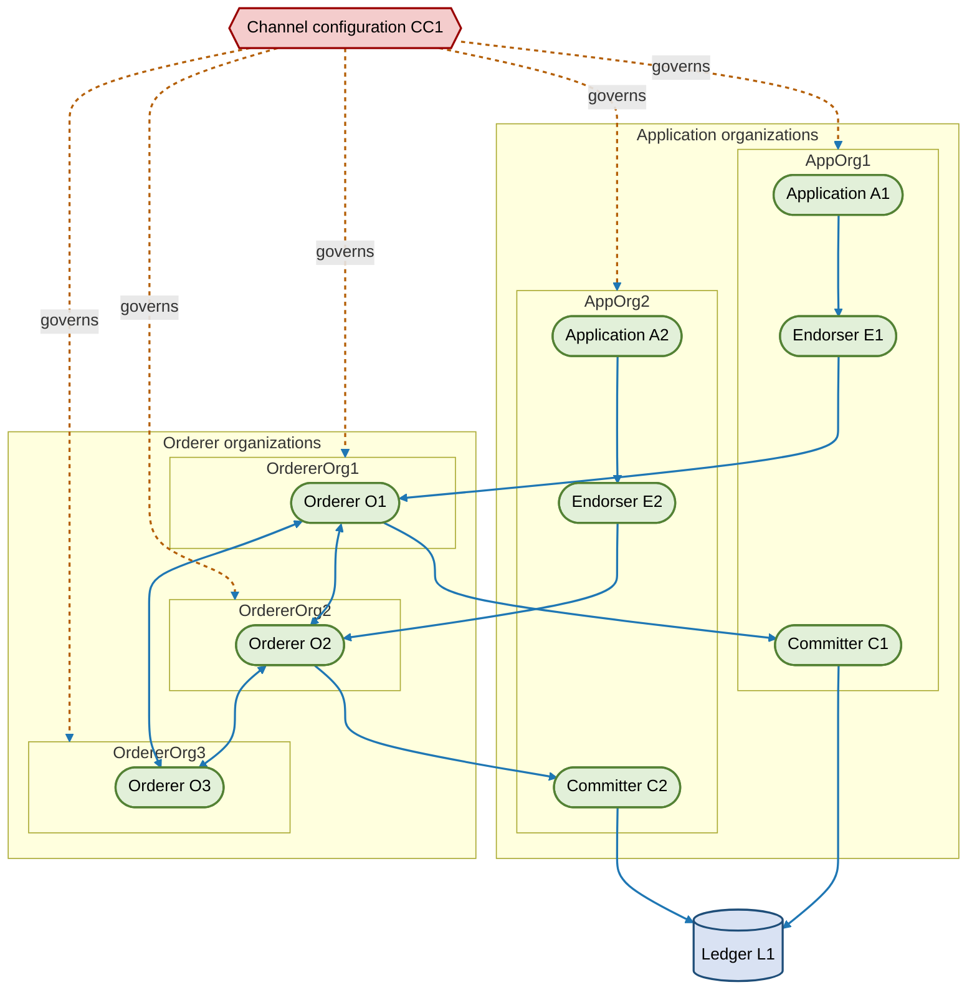

## Trust and identity material

Every member organization needs cryptographic identity material before it can join the network. Fabric-X uses X.509 certificates and MSPs to decide whether an identity belongs to an organization and what role it has.

Identity material turns an administrative statement into something machines can verify. It is not enough for a node to claim that it belongs to `AppOrg1`; it must present a certificate that chains to the CA trusted by `AppOrg1`'s MSP. Other components use the MSP information in channel configuration to make that check consistently.

Private keys stay with the organization, user, or node that owns them. Public CA certificates and MSP definitions are shared through configuration. This split lets organizations remain operationally independent while still giving the network a common way to verify signatures.

A typical organization has:

- A **signing CA** that issues identity certificates for admins, users, and nodes.
- A **TLS CA** that issues certificates for secure network communication.
- An **organization MSP** containing public trust material used by other members to verify the organization.
- **Local MSPs** for nodes and users, containing private keys and signed certificates used by that component.

The following flow is not a transaction flow. It is a trust-material flow. CAs create certificates; organization MSPs publish verification material; local MSPs stay with individual components and identities.

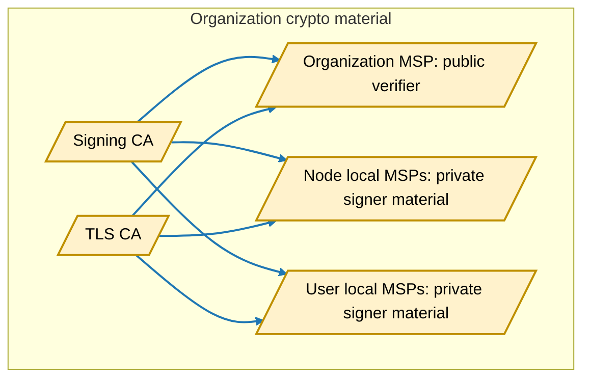

### Organization MSP versus local MSP

The **organization MSP** and a **local MSP** answer different questions. The organization MSP answers, "How does the network recognize members of this organization?" A local MSP answers, "How does this specific component or user prove its own identity and sign messages?"

An organization MSP is public verification material. It is included in channel configuration so every network participant can validate certificates from that organization. It normally contains CA certificates, TLS CA certificates, NodeOU role mapping, certificate revocation information, and other material needed to verify identities. It should not contain private signing keys, because it is distributed as trust material to other organizations and nodes.

A local MSP belongs to one runtime actor: an endorser, committer, orderer node, admin, or application user. It contains that actor's signing certificate and private key, plus enough CA material to build and validate its certificate chain. The local MSP is operationally sensitive because the private key lets the actor sign proposals, endorsements, configuration updates, or node messages depending on its role.

In practical terms, the organization MSP is a **verifier bundle**: public roots, intermediate certificates, OU rules, and revocation material that other members need in order to accept or reject signatures. A local MSP is a **signer bundle**: the actor's certificate, private key, and supporting chain material that the actor uses when it signs or authenticates. If the organization MSP changes, the network's trust definition changes. If a local MSP changes, one actor's signing identity changes.

| Question | Organization MSP | Local MSP |
| --- | --- | --- |
| Main purpose | Verify identities from an organization | Let one component or user prove and sign as itself |
| Scope | Whole organization | One node, admin, or user |
| Shared with channel? | Yes, public trust material is referenced by channel configuration | No, private material stays with the component or user |
| Contains private key? | No | Yes |
| Used by | Other nodes, committers, orderers, policy evaluators | The component or user that owns it |
| Example for application org | `AppOrg1` MSP verifies AppOrg1 clients, endorsers, and committers | `E1` endorser local MSP signs endorsements; `C1` committer local MSP authenticates the committer |
| Example for orderer org | `OrdererOrg1` MSP verifies OrdererOrg1 admins and orderer nodes | `O1` orderer local MSP authenticates and signs as orderer node `O1` |

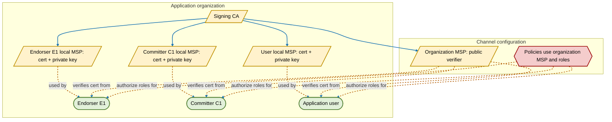

The same pattern applies to orderer organizations. The orderer organization MSP is the public verifier for the organization. Each orderer node has its own local MSP, so the ordering service can authenticate that specific node. If a node's private key is rotated, its local MSP changes. If the organization's CA or trust root changes, the organization MSP in channel configuration must change through a policy-approved configuration update.

This distinction is central to membership changes. Adding an organization requires adding its organization MSP to channel configuration. Starting its components requires distributing local MSPs only to those components. Removing an organization withdraws the organization MSP or its policy authority from channel configuration; after that, local MSPs from that organization no longer satisfy current channel policy even if the files still exist on disk.

`cryptogen` is a development and test utility that generates sample X.509 crypto material from a declarative topology. It is useful for tutorials, local networks, and repeatable examples. Production networks should normally use a CA-based enrollment flow, such as Fabric CA or an enterprise CA, so identities can be issued, renewed, revoked, and audited through operational processes. For command details, see [cryptogen CLI reference](../../cli/cryptogen.md).

The `cryptogen` configuration mirrors the organization model. `OrdererOrgs` produce orderer organization MSPs and orderer node local MSPs. `PeerOrgs` produce application organization MSPs plus local MSPs for endorsers, committers, users, and admins. `GenericOrgs` can describe mixed roles when a deployment needs custom layout.

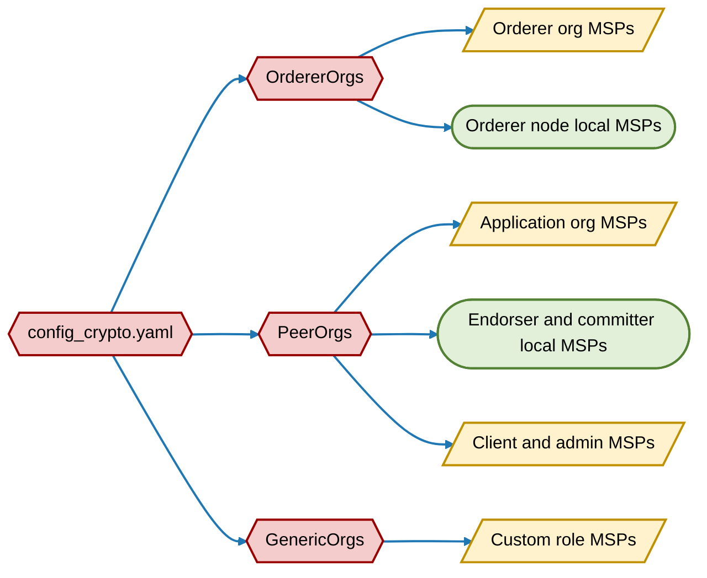

When `EnableNodeOUs` is enabled, certificate Organizational Units identify roles. This lets policies distinguish admins, clients, peers, and orderers without copying admin certificates into every node MSP.

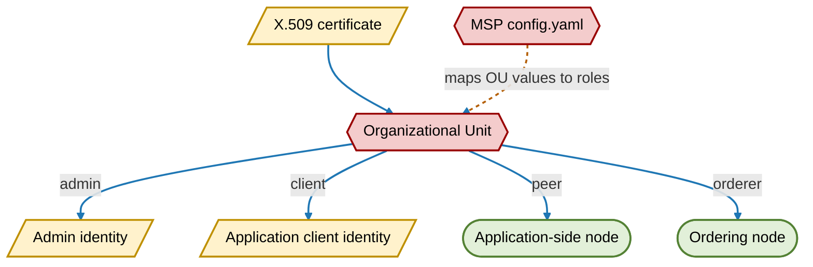

## Channel configuration

Channel configuration is the agreement that forms the network. It contains organization MSP definitions, policies, service endpoints, and ordering membership. The first channel configuration is stored in the genesis configuration block. Later changes create new configuration blocks.

Think of channel configuration as the network's constitution plus its current membership registry. It records who the members are, how their identities are verified, which groups of signatures can approve changes, and which ordering nodes participate in block production. Runtime components consult this configuration when deciding whether a request or peer is valid.

Configuration changes are ledger events. When membership changes, the network does not silently mutate local files on every node. Instead, approved configuration updates are ordered, committed, and recorded. This gives members a common history of how governance changed over time.

This diagram shows configuration assembly. Application MSPs and orderer MSPs are public verification material. Policies decide who can do what. Endpoints tell components where to connect. The orderer set defines the initial ordering service.

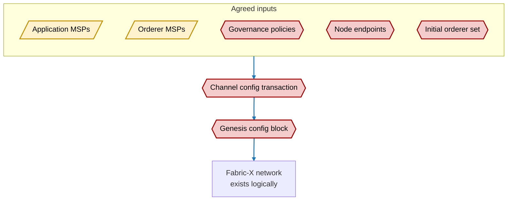

Policies answer governance questions such as:

- Which admins can update application organization membership?
- Which admins can update orderer organization membership?
- Which signatures are required to change ordering service membership?
- Which organizations can endorse, submit, validate, or administer network resources?

For more about policies, see [Policies](../policies/policies.md). For more about MSPs, see [Membership](../membership/membership.md).

## How the network is formed

Network formation has five high-level phases. Each phase has a different output: a governance agreement, crypto material, a configuration block, running components, then transaction processing.

These phases are shown in a straight line for clarity, but real deployments often iterate. Organizations may revise policies after seeing the proposed MSP layout. Operators may adjust endpoints after deployment planning. The concept remains the same: policy and identity decisions must be settled before components can safely trust each other.

The phases also divide responsibility. Business and governance stakeholders usually drive role and policy decisions. Security administrators handle CA and MSP material. Platform operators deploy orderers, endorsers, and committers. Application teams connect clients once the network is ready.

```mermaid
flowchart LR
    P1{{1. Agree roles and policies}}
    P2[/2. Prepare crypto and MSPs/]
    P3{{3. Build channel configuration}}
    P4([4. Start and join nodes])
    P5([5. Submit and commit transactions])

    P1 --> P2 --> P3 --> P4 --> P5

    linkStyle default stroke:#1f77b4,stroke-width:2px

    classDef component fill:#e2f0d9,stroke:#548235,stroke-width:2px,color:#000
    classDef identity fill:#fff2cc,stroke:#bf9000,stroke-width:2px,color:#000
    classDef config fill:#f4cccc,stroke:#990000,stroke-width:2px,color:#000
    class P1,P3 config
    class P2 identity
    class P4,P5 component
```

### 1. Agree roles and policies

Before any node starts, organizations agree who participates and what each participant may do. This is the point where the network's trust assumptions are made explicit.

The agreement should cover both normal operation and future change. Normal operation includes who can submit, endorse, order, and commit. Future change includes who can add members, remove members, rotate certificates, change orderer membership, and update policies. A network that cannot evolve safely will eventually become hard to operate.

Application organizations decide:

- Which applications and users need access.
- Which endorsement and validation responsibilities they will operate.
- Which admins can sign future configuration updates.

Orderer organizations decide:

- Which orderer nodes form the initial ordering service.
- Which ordering protocol and endpoints are used.
- Which admins can approve orderer membership changes.

The following sequence is a governance conversation, not a runtime protocol. It shows the two organization classes producing the policy inputs that later become channel configuration.

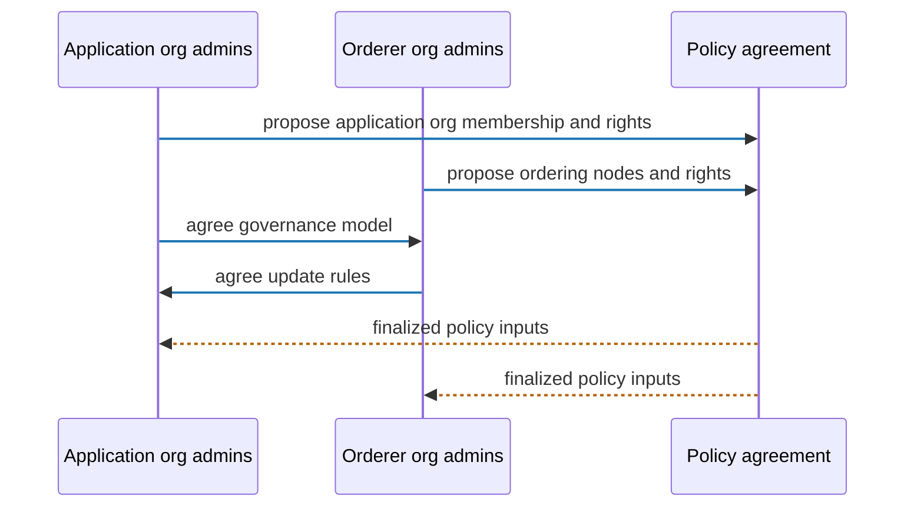

### 2. Prepare crypto and MSPs

Each organization prepares its own CA and MSP material. Organizations do not share private keys. They share public MSP material through channel configuration so other members can verify identities.

This phase establishes independent roots of trust. Each organization controls its CA and decides how to issue certificates to admins, users, and nodes. The network does not need access to those CA private keys. It only needs enough public material to verify that future signatures come from valid organization identities.

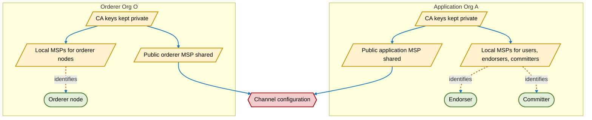

For development and test networks, `cryptogen` can generate this material from a declarative topology. It can also extend existing sample crypto material by creating missing nodes, users, or new organizations while leaving existing keys and certificates untouched. For production, use a CA-based enrollment flow, such as Fabric CA or an enterprise CA, so certificate issuance, renewal, revocation, and audit are managed through operational controls.

### 3. Build the initial channel configuration

Admins combine public MSP material and policy decisions into channel configuration `CC1`. The configuration block makes the network logically exist even before nodes have fully joined.

This is the transition from planning to a concrete network definition. Before this point, organizations may have certificates and deployment plans, but no shared channel state. After this point, there is a configuration block that every legitimate node can use as the common starting point for the network.

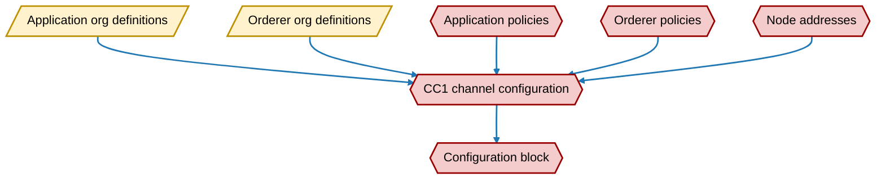

`CC1` is the first network agreement encoded as data. It contains who the members are, which public MSPs identify them, which components can participate, and which policies must approve later updates.

### 4. Start and join nodes

Nodes use their local MSPs to prove identity and the channel configuration to understand the network. Orderer nodes join the ordering service. Committers connect to receive ordered blocks. Endorsers become available for applications.

Joining is therefore both local and shared. Locally, a node needs its private key, certificate, TLS material, and configuration. Shared across the network, the node's organization and role must be recognized by channel configuration. Both sides must line up before the node can participate usefully.

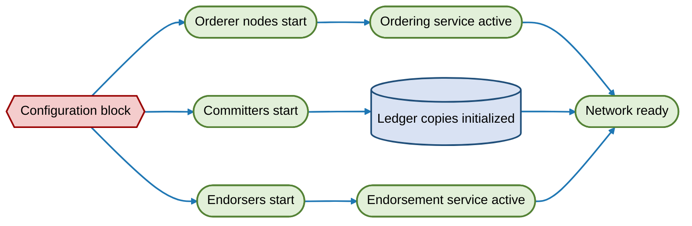

The orderer path must become healthy before blocks can be produced. Committers must sync from ordering service before they can provide a current ledger view. Endorsers can serve proposals once their identities and policies are valid for the channel.

### 5. Submit and commit transactions

Once the network is active, applications can submit transactions. The channel configuration and MSPs govern each signature check along the path.

The transaction path combines work from both organization classes. Application organizations create proposals, endorse results, and commit validated blocks. Orderer organizations provide the common order that all committers use. This separation lets endorsement and validation policy evolve independently from ordering-service operations.

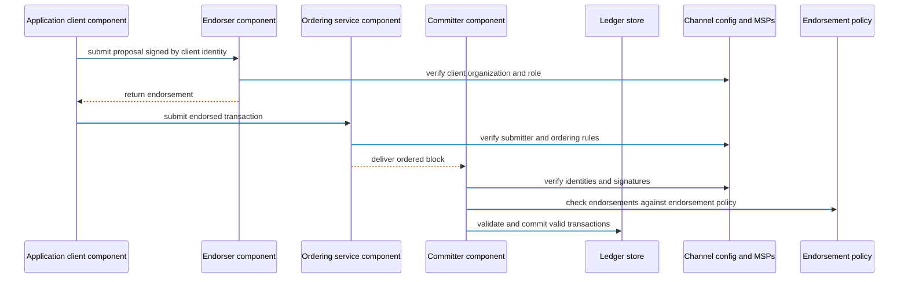

In this sequence, every runtime hop depends on identity verification. The endorser checks client authority. The ordering service checks submitter authority. The committer checks signatures and evaluates endorsements against the applicable endorsement policy before updating the ledger.

## Adding a new organization

Adding an organization is a configuration change plus an operational rollout. The organization is not a network member until its MSP and rights are added to channel configuration by a policy-approved update.

The new organization may prepare keys, certificates, nodes, and applications before the update, but those preparations do not grant authority by themselves. Authority begins when the existing network accepts the updated configuration. After that, runtime rollout makes the new authority usable.

This two-part model prevents accidental membership. Operators can stage infrastructure safely, and administrators can review the exact MSPs, endpoints, and policies before the new organization participates.

There are two common cases: adding an application organization and adding an orderer organization.

### Adding an application organization

A new application organization joins when existing members agree to let it submit, endorse, validate, or administer application-side resources. The organization must prepare both governance material and runtime components. The governance material is its public MSP and policy entries. The runtime components are applications, endorsers, and committers.

The important design question is what kind of participant the new organization will be. Some organizations only need client identities to submit transactions. Others must run endorsers because their approval is required by business policy. Others also run committers so they maintain an independent copy of ledger state. The configuration update should reflect the intended role rather than blindly granting every capability.

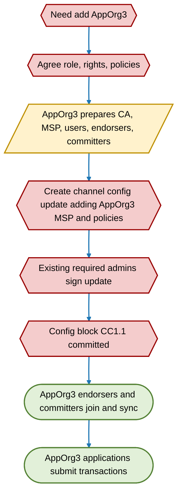

Detailed steps:

1. **Decide why the organization is joining.** Existing members decide whether the new organization can only submit transactions, can also endorse, can run committers, or can administer future changes.
2. **Prepare identity material.** The new organization creates or uses its CA, generates its organization MSP, and creates local MSPs for admins, users, endorsers, and committers. With `cryptogen`, this maps to adding a new `PeerOrgs` entry or extending existing crypto output with a new organization.
3. **Draft the configuration update.** The update adds the organization MSP, its policy references, and any required endpoints or application-side capabilities.
4. **Collect required approvals.** Current channel policies decide whose signatures are needed. For example, a majority of existing application organization admins may need to approve.
5. **Commit the configuration update.** Once accepted, the channel has a new configuration block, such as `CC1.1`. Existing nodes continue running; they learn the new membership from configuration.
6. **Start the new organization's nodes.** New endorsers and committers start with their local MSPs and channel configuration. Committers catch up from existing blocks until their ledger view is current.
7. **Enable applications.** Client applications use identities from the new organization and submit transactions subject to channel policy.

The before/after view highlights that adding an application organization does not replace the ordering service. It expands the application organization group and the policies that refer to that group.

```mermaid
flowchart LR
    subgraph Before[Before CC1.1]
        A1([AppOrg1 components])
        A2([AppOrg2 components])
        O([Existing orderer organizations])
    end

    subgraph After[After CC1.1]
        A1b([AppOrg1 components])
        A2b([AppOrg2 components])
        A3b([AppOrg3 application, endorser, committer added])
        Ob([Existing orderer organizations unchanged])
    end

    Before -->|config update approved| After

    linkStyle default stroke:#1f77b4,stroke-width:2px

    classDef component fill:#e2f0d9,stroke:#548235,stroke-width:2px,color:#000
    class A1,A2,O,A1b,A2b,A3b,Ob component
```

```mermaid
%%{init: {"themeCSS": ".messageLine0,.messageLine1{stroke:#1f77b4!important;stroke-width:2px!important}.messageLine1{stroke:#b45f06!important}.messageLine1[style*=\"stroke-dasharray\"]{stroke:#b45f06!important}"}}%%
sequenceDiagram
    participant New as AppOrg3 admin identity
    participant Existing as Existing org admin identities
    participant Config as Channel configuration
    participant Nodes as AppOrg3 endorser and committer components

    New->>Existing: share public MSP and requested application rights
    Existing->>Existing: evaluate governance and risk
    Existing->>Config: sign config update if policy satisfied
    Config-->>Existing: emit CC1.1
    New->>Nodes: start endorsers and committers with local MSPs
    Nodes->>Config: verify AppOrg3 is now member
```

### Adding an orderer organization

Adding an orderer organization changes ordering service membership. This is usually more sensitive than adding an application organization because ordering nodes affect block production availability and fault tolerance.

The change should be planned with the ordering protocol in mind. Adding an orderer node can improve decentralization or resilience, but it can also change quorum size, operational dependencies, and failure handling. Members should understand whether the new organization is adding capacity, replacing an existing operator, or changing the trust distribution of the ordering service.

The new orderer organization contributes ordering governance material and one or more orderer nodes. The channel configuration must add both the organization trust definition and the ordering membership information needed by the ordering service.

```mermaid
flowchart TB
    Start{{Need add OrdererOrg4}}
    Plan{{Plan ordering topology and fault tolerance}}
    Crypto[/OrdererOrg4 prepares orderer MSP and node TLS material/]
    Config{{Config update adds orderer org MSP, nodes, and endpoints}}
    Consent{{Existing ordering policy approves}}
    Reconfig([Ordering service applies new membership])
    StartNodes([OrdererOrg4 starts orderer nodes])
    Stable([Ordering service reaches stable new set])

    Start --> Plan --> Crypto --> Config --> Consent --> Reconfig --> StartNodes --> Stable

    linkStyle default stroke:#1f77b4,stroke-width:2px

    classDef component fill:#e2f0d9,stroke:#548235,stroke-width:2px,color:#000
    classDef identity fill:#fff2cc,stroke:#bf9000,stroke-width:2px,color:#000
    classDef config fill:#f4cccc,stroke:#990000,stroke-width:2px,color:#000
    class Start,Plan,Config,Consent config
    class Crypto identity
    class Reconfig,StartNodes,Stable component
```

Detailed steps:

1. **Plan ordering impact.** Members decide how many orderer nodes the new organization will run and how this changes quorum, availability, and operational responsibility.
2. **Prepare orderer identity material.** The organization generates its orderer organization MSP and local MSPs/TLS certificates for each orderer node. With `cryptogen`, this maps to adding or extending an `OrdererOrgs` entry.
3. **Draft the configuration update.** The update adds the orderer organization MSP and the new orderer node endpoints to the ordering section of channel configuration.
4. **Collect ordering-policy approvals.** Existing policy determines which orderer/application admins must approve. Some networks require separate approval by orderer organization admins.
5. **Commit and apply ordering reconfiguration.** The ordering service learns the new consenter or orderer set from the configuration block.
6. **Start and observe new nodes.** New orderer nodes use their local MSPs to authenticate, connect, and begin participating according to the ordering protocol.
7. **Confirm service health.** Operators verify that block production and delivery continue with the expanded ordering service.

```mermaid
flowchart LR
    subgraph Before[Ordering service before]
        O1([OrdererOrg1 node O1])
        O2([OrdererOrg2 node O2])
        O3([OrdererOrg3 node O3])
    end

    subgraph After[Ordering service after]
        O1b([OrdererOrg1 node O1])
        O2b([OrdererOrg2 node O2])
        O3b([OrdererOrg3 node O3])
        O4b([OrdererOrg4 node O4 added])
    end

    Before -->|approved config update| After

    linkStyle default stroke:#1f77b4,stroke-width:2px

    classDef component fill:#e2f0d9,stroke:#548235,stroke-width:2px,color:#000
    class O1,O2,O3,O1b,O2b,O3b,O4b component
```

## Removing an existing organization

Removing an organization is also a configuration change plus operational cleanup. Removal should be planned so that transactions, block delivery, and application availability remain stable.

Removal is not only a deletion from a list. Policies may mention the organization, clients may use its certificates, applications may depend on its endorsers, and committers or orderers may be part of availability assumptions. Those dependencies should be identified before the configuration update is committed.

Removal does not erase historical ledger data. Blocks already committed remain on the ledger, including transactions and configuration blocks involving the removed organization. Removal only changes future authority and participation.

The general removal flow has two halves. First, governance removes future rights from channel configuration. Second, operators stop or isolate runtime components that no longer have authority.

```mermaid
flowchart TB
    Start{{Need remove organization}}
    Assess{{Assess role and dependencies}}
    Quiesce([Stop new work or migrate clients])
    Update{{Create config update removing rights and membership}}
    Approve{{Collect required signatures}}
    Commit{{Commit new config block}}
    Decom([Decommission or isolate nodes])
    Monitor([Monitor network health])

    Start --> Assess --> Quiesce --> Update --> Approve --> Commit --> Decom --> Monitor

    linkStyle default stroke:#1f77b4,stroke-width:2px

    classDef component fill:#e2f0d9,stroke:#548235,stroke-width:2px,color:#000
    classDef config fill:#f4cccc,stroke:#990000,stroke-width:2px,color:#000
    class Start,Assess,Update,Approve,Commit config
    class Quiesce,Decom,Monitor component
```

### Removing an application organization

Application organization removal stops that organization from future application-side participation. Its clients should no longer submit transactions, its endorsers should no longer satisfy endorsement policies, and its committers should no longer be treated as active participants.

The most common risk is leaving policies that still require the removed organization. For example, if an endorsement policy requires signatures from `AppOrg2`, removing `AppOrg2` without changing that policy can make affected transactions impossible to validate. Removal planning therefore starts with policy and application dependency review, not with stopping nodes.

```mermaid
flowchart TB
    Start{{Remove AppOrg2}}
    Impact{{Identify clients, endorsers, committers, policies}}
    Policy{{Update endorsement and admin policies}}
    Config{{Remove or disable AppOrg2 MSP references}}
    Approve{{Existing required admins sign}}
    Commit{{Config block CC1.2 committed}}
    Stop([Stop AppOrg2 applications, endorsers, and committers])
    Verify([Verify remaining orgs can transact])

    Start --> Impact --> Policy --> Config --> Approve --> Commit --> Stop --> Verify

    linkStyle default stroke:#1f77b4,stroke-width:2px

    classDef component fill:#e2f0d9,stroke:#548235,stroke-width:2px,color:#000
    classDef config fill:#f4cccc,stroke:#990000,stroke-width:2px,color:#000
    class Start,Impact,Policy,Config,Approve,Commit config
    class Stop,Verify component
```

Detailed steps:

1. **Assess dependencies.** Determine which applications, users, endorsement policies, namespaces, and operational procedures depend on the organization.
2. **Migrate or stop clients.** Applications using identities from the organization must move to another member identity or stop submitting before removal is enforced.
3. **Update policies.** Any endorsement, validation, or admin policy that references the organization must be rewritten. For example, a policy requiring `AppOrg2` endorsement must be changed before `AppOrg2` is removed.
4. **Create configuration update.** The update removes the organization's active membership and policy references, or marks it unusable for future decisions depending on network governance practice.
5. **Collect approvals.** Current policies still govern the removal. The organization being removed may or may not be required to sign, depending on existing policy.
6. **Commit new configuration.** After commitment, certificates from the removed organization no longer satisfy current membership or policy checks.
7. **Decommission nodes.** Stop or isolate the organization's applications, endorsers, and committers. Preserve logs and ledger data according to operational and legal requirements.
8. **Verify remaining flow.** Confirm remaining applications can still endorse, order, validate, and commit.

The before/after view separates active membership from history. `AppOrg2` loses future authority, but previous blocks remain part of ledger history.

```mermaid
flowchart LR
    subgraph Before[Before removal]
        A1([AppOrg1 application components])
        A2([AppOrg2 application components active])
        A3([AppOrg3 application components])
        L[(Ledger history)]
    end

    subgraph After[After removal]
        A1b([AppOrg1 application components])
        A3b([AppOrg3 application components])
        Lb[(Ledger history still includes AppOrg2 past blocks)]
    end

    Before -->|approved config update| After

    linkStyle default stroke:#1f77b4,stroke-width:2px

    classDef component fill:#e2f0d9,stroke:#548235,stroke-width:2px,color:#000
    classDef ledger fill:#d9e2f3,stroke:#1f4e79,stroke-width:2px,color:#000
    class A1,A2,A3,A1b,A3b component
    class L,Lb ledger
```

### Removing an orderer organization

Orderer organization removal changes the ordering service. The network must preserve enough orderer nodes to continue producing blocks under the ordering protocol.

This operation affects the infrastructure that every application organization depends on. If the remaining orderer set is too small or incorrectly configured, applications may still be able to endorse transactions but blocks may stop being produced or delivered. For that reason, orderer removal should be treated as a controlled reconfiguration of a distributed service.

```mermaid
flowchart TB
    Start{{Remove OrdererOrg2}}
    Quorum{{Check ordering quorum and availability}}
    Drain([Move clients and committers away from removed endpoints])
    Config{{Config update removes orderer nodes, endpoints, and MSP rights}}
    Approve{{Required admins sign}}
    Reconfig([Ordering service applies smaller set])
    Stop([Stop removed orderer nodes])
    Health([Verify block production])

    Start --> Quorum --> Drain --> Config --> Approve --> Reconfig --> Stop --> Health

    linkStyle default stroke:#1f77b4,stroke-width:2px

    classDef component fill:#e2f0d9,stroke:#548235,stroke-width:2px,color:#000
    classDef config fill:#f4cccc,stroke:#990000,stroke-width:2px,color:#000
    class Start,Quorum,Config,Approve config
    class Drain,Reconfig,Stop,Health component
```

Detailed steps:

1. **Check ordering safety.** Operators confirm the remaining orderer set can still meet fault-tolerance and quorum requirements after removal.
2. **Plan endpoint transition.** Clients and committers must know which remaining orderer endpoints to use. Load balancers, DNS records, and service discovery may need updates.
3. **Prepare configuration update.** The update removes the orderer organization's MSP from ordering authority and removes its orderer nodes from active ordering membership.
4. **Collect required approvals.** Existing channel and ordering policies decide which admins must sign.
5. **Commit and apply reconfiguration.** The ordering service transitions to the reduced membership using the new configuration block.
6. **Stop removed orderers.** Once no longer part of active ordering membership, the removed organization's orderer nodes should be stopped or isolated.
7. **Verify block production and delivery.** Remaining orderers must continue creating blocks, and committers must continue receiving them.

```mermaid
flowchart TB
    subgraph Before[Before removal]
        direction LR
        O1([OrdererOrg1 node O1])
        O2([OrdererOrg2 node O2 active])
        O3([OrdererOrg3 node O3])
        O1 <--> O2
        O2 <--> O3
        O1 <--> O3
    end

    Update{{Approved config update}}

    subgraph After[After removal]
        direction LR
        O1b([OrdererOrg1 node O1])
        O3b([OrdererOrg3 node O3])
        O1b <--> O3b
    end

    Before --> Update --> After

    linkStyle default stroke:#1f77b4,stroke-width:2px

    classDef component fill:#e2f0d9,stroke:#548235,stroke-width:2px,color:#000
    classDef config fill:#f4cccc,stroke:#990000,stroke-width:2px,color:#000
    class O1,O2,O3,O1b,O3b component
    class Update config
```

## Membership change summary

Both add and remove operations follow the same governance pattern: prepare or retire identity and topology, update channel configuration, satisfy policy, then roll out or retire runtime components.

The symmetry is intentional. Adding does not become effective until configuration grants authority. Removing does not become effective until configuration withdraws authority. Runtime actions before or after the configuration update are operational steps, but the channel configuration is what changes network membership.

```mermaid
flowchart TB
    subgraph Add[Add organization]
        A1[/Prepare MSP and node material/]
        A2{{Add org definition and rights}}
        A3{{Approve under current policy}}
        A4([Start nodes and applications])
    end

    subgraph Remove[Remove organization]
        R1{{Assess dependencies}}
        R2{{Remove rights and policy references}}
        R3{{Approve under current policy}}
        R4([Stop or isolate nodes])
    end

    Current{{Current channel configuration}} --> Add
    Current --> Remove
    Add --> NewConfig{{New channel configuration}}
    Remove --> NewConfig

    linkStyle default stroke:#1f77b4,stroke-width:2px

    classDef component fill:#e2f0d9,stroke:#548235,stroke-width:2px,color:#000
    classDef identity fill:#fff2cc,stroke:#bf9000,stroke-width:2px,color:#000
    classDef config fill:#f4cccc,stroke:#990000,stroke-width:2px,color:#000
    class A1 identity
    class A4,R4 component
    class A2,A3,R1,R2,R3,Current,NewConfig config
```

The most important rule is that **current policy controls the next configuration**. Existing members cannot bypass the policy already recorded on the channel. This is how Fabric-X keeps network evolution declarative and auditable.

## Network recap

A Fabric-X network forms when application organizations and orderer organizations agree on shared channel configuration. Application organizations bring business identities, applications, endorsers, and committers. Orderer organizations bring orderer nodes and ordering-service governance. MSPs connect certificates to organizations; policies connect organizations to rights.

The practical result is a network that can be administered declaratively. Administrators do not rely on informal knowledge of which machines should be trusted. They rely on MSP definitions, roles, endpoints, and policies recorded in channel configuration. Components then use that shared configuration to make consistent authorization decisions.

Network membership changes through configuration updates. Adding a member introduces its MSP, roles, endpoints, and policies. Removing a member removes future authority while preserving historical ledger records. In both cases, the change only becomes effective after the signatures required by current channel policy approve the new configuration block.

For deployment details, see Deploying a production network. For ordering concepts, see The Ordering Service. For policy concepts, see [Policies](../policies/policies.md).
