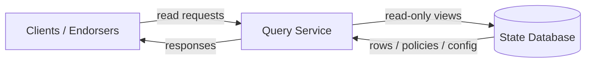

<!-- SPDX-License-Identifier: Apache-2.0 -->
# Query Service

## Overview

This page summarizes the Fabric-X read path. Canonical implementation details live in the public [Query Service](https://hyperledger.github.io/fabric-x-committer/query-service/) documentation.

The Query Service provides read-only access to committed Fabric-X state. It is separate from the validation and commit pipeline.

Canonical implementation details live in [Query Service](https://hyperledger.github.io/fabric-x-committer/query-service/).

## Responsibilities

- Open and close read-only database views.
- Serve namespace key queries from committed state.
- Return namespace policies and configuration transaction data.
- Batch compatible views and queries to reduce database overhead.
- Provide configurable database isolation for read paths.

## Boundaries

The Query Service does not fetch blocks, verify signatures, validate read sets, or commit writes. Clients and endorsers use it for reads; the Validator-Committer owns writes and final transaction status.

## Data Flow

## See Also

- [Query Service](https://hyperledger.github.io/fabric-x-committer/query-service/)
- [Validator-Committer](../committer/docs/validator-committer.md)
- [Ledger](ledger.md)
