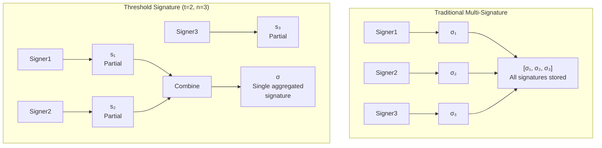
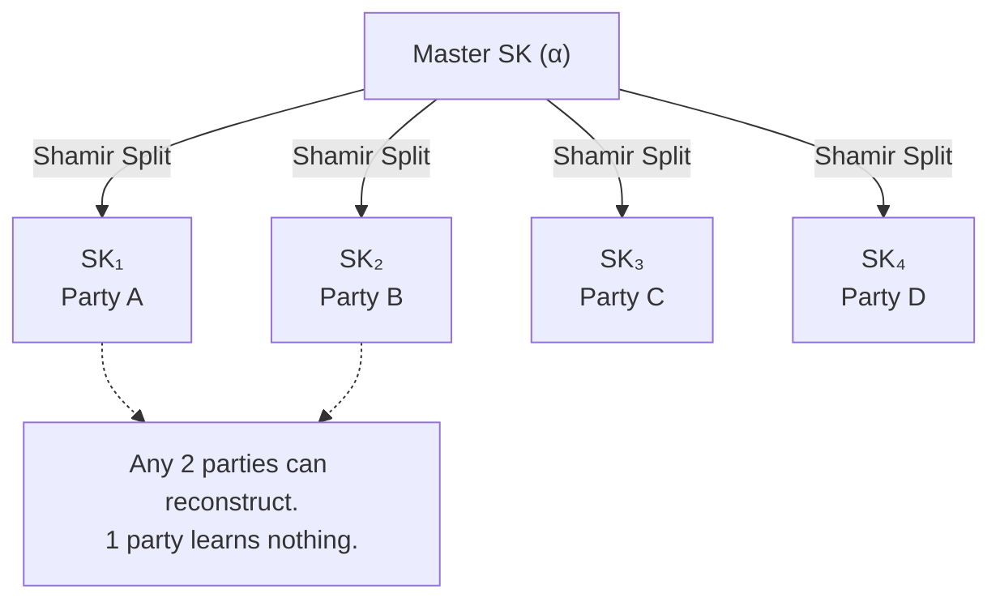
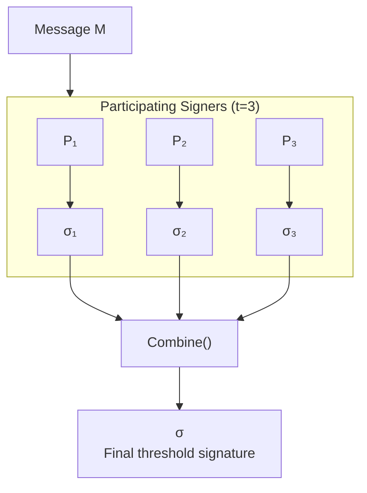
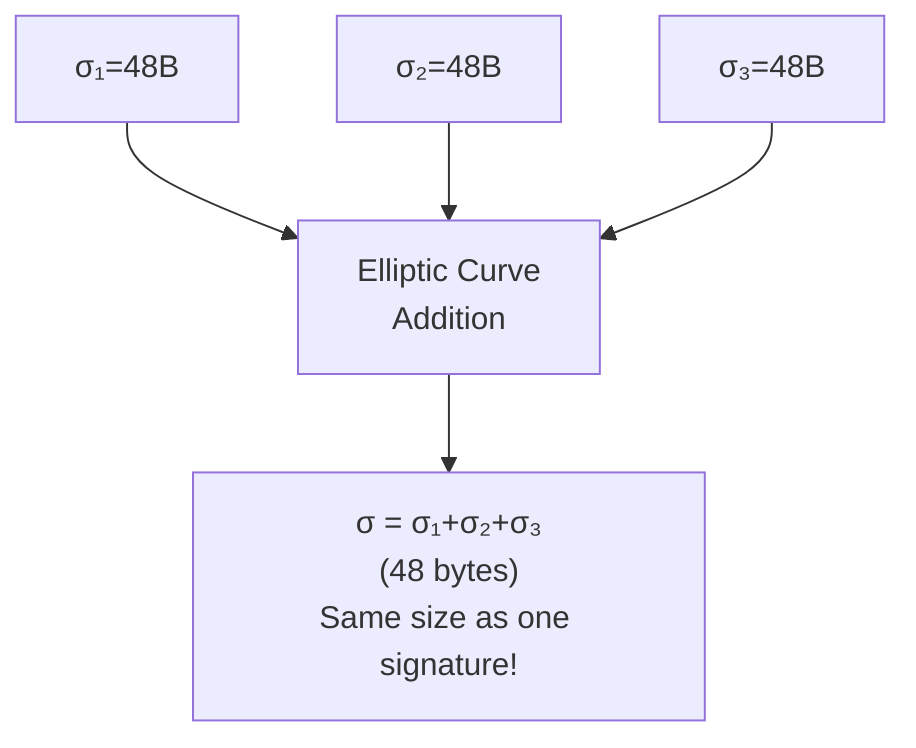

<!-- SPDX-License-Identifier: Apache-2.0 -->
# Threshold Signatures in Fabric-X

## Overview

Threshold signatures enable a group of signers to collectively produce a single signature. Instead of requiring all participants to sign individually, any subset of size `t` or more from a group of `n` participants can generate a valid signature. This cryptographic primitive forms the foundation of Fabric-X's endorsement mechanism.

## What Are Threshold Signatures?

A threshold signature scheme allows distributed parties to share signing authority. The key property: **any `t` out of `n` parties can sign, but fewer than `t` cannot**. This cryptographic primitive distributes trust across multiple participants while maintaining a single, compact signature output. Unlike traditional multi-signature schemes where each signer produces an independent signature, threshold signatures mathematically combine partial signatures into one aggregated result that verifies against a single public key.

### Traditional vs Threshold Signatures



## The (t,n) Threshold Scheme

### Key Generation

During setup, a master secret key is split into `n` shares using **Shamir's Secret Sharing**. Each participant receives one share. No single party knows the complete secret key. This distribution happens through polynomial interpolation where the master key represents the constant term of a degree-(t-1) polynomial. Each party receives a point on this polynomial, and any t points suffice to reconstruct the original secret through Lagrange interpolation. The mathematical structure ensures that fewer than t shares reveal absolutely no information about the master key.



### Signing Process

The signing process unfolds in three sequential phases. First, during **partial signature generation**, each of the `t` participating parties independently signs the message using their secret share. Each party computes their partial signature locally without revealing their secret share to others. Second, during **signature combination**, these partial signatures are mathematically combined using Lagrange coefficients derived from the participant indices. This combination happens through elliptic curve addition, producing a single aggregated signature. Finally, during **verification**, the combined signature verifies against the single public key using standard BLS verification equations. The verifier needs only the aggregated public key and the final signature, remaining completely unaware of how many parties participated or which specific parties contributed.



## BLS Signature Aggregation

Fabric-X uses **BLS (Boneh-Lynn-Shacham)** signatures for threshold operations. BLS provides unique properties essential for blockchain systems.

### BLS Fundamentals

BLS signatures operate on elliptic curve pairings, leveraging bilinear maps between two distinct groups. The scheme generates a key pair where the secret key is a scalar `sk ∈ ℤₚ` and the public key is computed as `pk = sk · G₂`, where G₂ represents the generator of the second group. To sign a message, the scheme computes `σ = sk · H(m)` where H is a hash-to-curve function that maps arbitrary messages to points on the elliptic curve. Verification uses the bilinear pairing equation `e(σ, G₂) = e(H(m), pk)`, which holds true if and only if the signature was produced with the correct secret key.

### Aggregation Properties

BLS signatures exhibit several powerful aggregation properties that make them ideal for threshold schemes. **Linear aggregation** allows multiple signatures to sum into a single signature through elliptic curve addition, expressed as `σ = σ₁ + σ₂ + ... + σₜ`. Public keys aggregate in the same manner, producing `pk = pk₁ + pk₂ + ... + pkₙ`. The scheme is **deterministic**, meaning the same message signed with the same key always produces the same signature without requiring randomness. This determinism eliminates the need for secure random number generation during signing. Perhaps most importantly, BLS produces **short signatures** consisting of a single group element, approximately 48 bytes when using the BLS12-381 curve.

### Aggregation Visualization



## Advantages Over Individual Signatures

### Privacy

Threshold signatures provide substantial privacy advantages over traditional multi-signature schemes. In a traditional multi-signature setup, all signer identities are revealed in the signature data, the exact quorum size remains visible, and the specific coalition of signers becomes public knowledge. Threshold signatures fundamentally change this dynamic by providing **signer ambiguity**. Verifiers learn only that at least `t` parties signed, but cannot determine which specific `t` parties contributed their shares. Any valid subset of size t could have produced the signature, protecting participant privacy in sensitive transactions where the identity of signers might reveal confidential business relationships or decision-making patterns.

### Signature Size

The signature size advantage of threshold signatures becomes dramatic as the number of signers increases. Traditional ECDSA multi-signature schemes require storing each individual signature, resulting in 192 bytes for 3 signers, 640 bytes for 10 signers, and 6,400 bytes for 100 signers. In stark contrast, BLS threshold signatures maintain a constant size of 48 bytes regardless of whether 3, 10, or 100 signers participated. This **constant signature size** property holds true regardless of the threshold `t` or the total number of participants `n`, providing enormous bandwidth and storage savings in large-scale deployments.

### Verification Speed

Verification speed represents another critical advantage of threshold signatures over traditional multi-signature approaches. When verifying k individual ECDSA signatures, the verifier must perform k separate pairing operations, one for each signature against its corresponding public key. This linear scaling creates a significant computational burden as the number of signers increases. Threshold signatures collapse this complexity to a single pairing operation. The verifier checks the aggregated signature against the aggregated public key in constant time, regardless of how many parties contributed to the signature. This O(1) verification complexity translates directly to faster block validation, reduced computational costs, and improved overall system throughput. The bandwidth savings compound this benefit, as threshold signatures require constant bandwidth rather than the O(k × signature_size) bandwidth demanded by traditional multi-signature schemes.

## Usage in Fabric-X Endorsement

### Endorsement Policy Integration

Fabric-X replaces traditional endorsement policies with threshold-based validation, fundamentally restructuring how transactions gain approval within the network. Instead of requiring explicit signatures from specific named peers, the system configures a threshold policy where any t out of n designated endorsing peers can validate a transaction.

### Transaction Endorsement Flow

The endorsement flow in Fabric-X uses an **endorser service** at each peer that handles partial signature aggregation:

```
┌─────────────────────────────────────────────────────────────────┐
│                     Client Request                              │
│                     (submits proposal)                          │
└──────────────────────────┬──────────────────────────────────────┘
                           │
                           ▼
┌─────────────────────────────────────────────────────────────────┐
│                   Endorser Service                              │
│  (running on each peer, handles partial signature aggregation) │
└──────────┬──────────────────────────────────────────────────────┘
           │
           │    Request endorsement from peers
           │    (n=5 configured endorsers)
           ▼
┌─────────────────────────────────────────────────────────────────┐
│              Endorsement Peers (n=5)                            │
│  ┌──────────┐ ┌──────────┐ ┌──────────┐ ┌──────────┐ ┌─────────┐│
│  │  Peer 1  │ │  Peer 2  │ │  Peer 3  │ │  Peer 4  │ │ Peer 5  ││
│  │ (Endorser│ │ (Endorser│ │ (Endorser│ │ (Endorser│ │(Endorser││
│  │ Service) │ │ Service) │ │ Service) │ │ Service) │ │Service) ││
│  └────┬─────┘ └────┬─────┘ └────┬─────┘ └────┬─────┘ └────┬────┘│
│       │            │            │            │            │     │
│       └────────────┴────────────┘            │            │     │
│                 t=3 respond                  │            │     │
│                (fastest responses)           │            │     │
└──────────────────────────────┬───────────────┴────────────┘     │
                               │                                  │
                               ▼                                  │
                    ┌──────────────────────┐                     │
                    │  Partial Signatures  │                     │
                    │   σ₁, σ₂, σ₃        │                     │
                    │  (each 48 bytes)    │                     │
                    └──────────┬───────────┘                     │
                               │                                  │
                               ▼                                  │
                    ┌──────────────────────┐                     │
                    │  AGGREGATION STEP   │  ← Happens in         │
                    │    Combine()         │    Endorser Service  │
                    │    (at the peers)   │    (NOT at client!)  │
                    └──────────┬───────────┘                     │
                               │                                  │
                               ▼                                  │
                    ┌──────────────────────┐                     │
                    │  Single Threshold    │                     │
                    │     Signature σ      │  ← 48 bytes total   │
                    │   (48 bytes)         │                     │
                    └──────────┬───────────┘                     │
                               │                                  │
                               ▼                                  │
                    ┌──────────────────────┐                     │
                    │   Return to Client   │                     │
                    └──────────┬───────────┘                     │
                               │                                  │
                               ▼                                  │
                    ┌──────────────────────┐                     │
                    │  Client submits tx   │                     │
                    │  with aggregated σ   │                     │
                    └──────────┬───────────┘                     │
                               │                                  │
                               ▼                                  │
                    ┌──────────────────────┐                     │
                    │   Orderer Validates  │                     │
                    │   (1 verification)   │                     │
                    └──────────────────────┘                     │
└─────────────────────────────────────────────────────────────────┘
```

**Key Points:**
- **Aggregation happens in the Endorser Service** at the peers, not at the client
- The endorser service collects partial signatures from responding peers
- The endorser service performs the `Combine()` operation to produce the single threshold signature
- Client receives the final aggregated signature (48 bytes)
- This design reduces client complexity and bandwidth requirements
- Client never sees individual partial signatures, only the final result

```
Transaction Endorsement Flow:

┌─────────────────────────────────────────────────────────────┐
│                     Client Request                          │
└──────────────────────────┬──────────────────────────────────┘
                           │
                           ▼
         ┌─────────────────────────────────┐
         │    Endorsement Peers (n=5)      │
         │  ┌───┐ ┌───┐ ┌───┐ ┌───┐ ┌───┐ │
         │  │ P₁│ │ P₂│ │ P₃│ │ P₄│ │ P₅│ │
         │  └─┬─┘ └─┬─┘ └─┬─┘ └─┬─┘ └─┬─┘ │
         │    │     │     │     │     │    │
         │    └─────┴─────┘     │     │    │
         │      t=3 respond     │     │    │
         └─────────────────────┼─────┼────┘
                               │     │
                               ▼     ▼
                    ┌──────────────────────┐
                    │  Partial Signatures  │
                    │   σ₁, σ₂, σ₃        │
                    └──────────┬───────────┘
                               │
                               ▼
                    ┌──────────────────────┐
                    │   Aggregate to σ     │
                    └──────────┬───────────┘
                               │
                               ▼
                    ┌──────────────────────┐
                    │  Single Threshold    │
                    │     Signature        │
                    └──────────┬───────────┘
                               │
                               ▼
                    ┌──────────────────────┐
                    │   Orderer Validates  │
                    │   (1 verification)   │
                    └──────────────────────┘
```

### Policy Configuration

Endorsement policies specify threshold parameters through a structured configuration that defines the total number of endorsing peers and the required threshold. The configuration includes the threshold type designation, the total count n of endorsing peers authorized to participate, the threshold t representing the minimum number of partial signatures required, and the list of public key shares for all n participants. These public key shares are typically aggregated off-chain into a single public key that the orderer uses for verification, though the individual shares remain available for explicit verification if needed.

### Benefits for Fabric-X

Threshold signatures deliver four primary benefits to the Fabric-X architecture. **Scalability** emerges as orderers verify exactly one signature regardless of how complex the endorsement policy becomes, whether requiring 3 out of 5 peers or 50 out of 100 peers. **Privacy** protects the identity of specific endorsing peers, as the aggregated signature reveals only that the threshold was met, not which peers participated. **Efficiency** manifests through reduced block sizes due to constant signature size and faster verification through single pairing operations. **Flexibility** allows network administrators to adjust threshold parameters without modifying the underlying verification logic, enabling dynamic policy changes as network conditions or trust relationships evolve.

## Cryptographic Properties

### Security Guarantees

Threshold signature schemes provide multiple layers of security guarantees essential for distributed systems. **Unforgeability** ensures that an adversary cannot produce a valid signature without controlling at least t secret shares, maintaining the fundamental threshold property even against computationally bounded attackers. **Robustness** guarantees that the protocol completes successfully even if some parties malfunction or behave incorrectly, provided at least t honest parties participate. **Proactive security** allows parties to periodically refresh their shares without changing the public key, limiting the window of opportunity for attackers who might compromise individual shares over time. **Threshold security** means the system degrades gracefully as parties become compromised, remaining fully secure as long as fewer than t parties are compromised and providing detection mechanisms once the threshold approaches.

### BLS12-381 Parameters

Fabric-X uses BLS12-381 curve for 128-bit security:

```
Curve Parameters:
┌─────────────────────────────────────────┐
│  Field: Fₚ where p = 400240955522...  │
│  Curve: y² = x³ + 4                    │
│  Group Order: q = 524358751751...     │
│  Embedding Degree: 12                  │
│  Security Level: 128 bits              │
└─────────────────────────────────────────┘

Signature Size: 48 bytes (G₁ element)
Public Key Size: 96 bytes (G₂ element)
```

**Implementation Reference:**
- BLS signature operations: `fabric-x-common/crypto/bls/`
- MSP integration: `fabric-x-common/msp/`
- Threshold signature aggregation: See `fabric-x-endorser` platform implementation

### Security Comparison

When comparing security properties across different signature schemes, several attack vectors reveal important distinctions. For key compromise scenarios where fewer than t parties are compromised, both ECDSA multi-signature and BLS threshold schemes remain secure, as the attacker lacks sufficient shares to forge signatures. However, when k ≥ t parties are compromised, both schemes break down, though threshold signatures provide clearer security boundaries. Signature malleability presents another differentiator: ECDSA signatures can be malleated due to their probabilistic nature, while BLS signatures remain immutable due to their deterministic construction. Rogue key attacks, where an adversary chooses their public key strategically to cancel out other keys, pose a threat to naive multi-signature schemes but are mitigated in BLS threshold signatures through proper key aggregation protocols that require proof of possession.

### Pairing-Based Verification

The bilinear pairing enables efficient verification through an elegant mathematical equation. The verification checks whether `e(σ, G₂) = e(H(m), pk)`, where σ represents the threshold signature as an element of group G₁, G₂ serves as the generator of the second group, H(m) denotes the message hashed to a curve point in G₁, pk represents the aggregated public key in G₂, and e denotes the bilinear pairing that maps from G₁ × G₂ to the target group Gₜ. This equation holds true if and only if the signature was produced correctly. The pairing operation exhibits three critical properties that make verification possible. **Bilinearity** means that e(a·P, b·Q) = e(P, Q)^(ab) for any scalars a, b and points P, Q, enabling the algebraic manipulations that allow signature aggregation. **Non-degeneracy** ensures that e(G₁, G₂) ≠ 1, preventing trivial solutions. **Computability** guarantees that efficient algorithms exist to calculate the pairing in practical time, making the scheme usable in real-world systems.

## Implementation Considerations

### Key Management

Implementing threshold signatures requires careful attention to key management throughout the system lifecycle. **Distributed Key Generation (DKG)** enables parties to jointly generate their secret shares without requiring a trusted dealer who knows the master secret. This eliminates a single point of failure and distributes trust among all participants from the very beginning. **Share refresh** protocols allow parties to periodically renew their shares while maintaining the same public key, limiting the damage from potential share compromise and enabling long-term key usage. **Share recovery** mechanisms permit lost or corrupted shares to be reconstructed from the remaining parties, provided at least t parties remain available to assist in the reconstruction process.

### Performance Optimization

Several optimization strategies can improve threshold signature performance in production deployments. **Batch verification** allows multiple signatures to be verified together in a single operation, reducing the amortized cost per signature at the expense of slightly higher latency for individual verifications. **Pre-computation** techniques cache expensive pairing results that can be reused across multiple verification operations, trading memory overhead for computational speed. **Aggregated public keys** reduce verification to a single key lookup, though this requires coordination among parties to compute and distribute the aggregated key. Each optimization involves trade-offs between computational cost, memory usage, latency, and coordination requirements that must be balanced according to specific deployment needs.

### Failure Modes

Understanding failure modes helps design robust threshold signature implementations. When **insufficient signers** participate, meaning fewer than t parties respond, the system simply cannot produce a valid signature. The transaction gets rejected or delayed until enough parties become available. This represents a liveness failure rather than a security failure. When a **malicious signer** provides an invalid partial signature, the combination protocol detects this during the aggregation phase. The system can identify which party submitted the invalid share and exclude that actor from the current signing round, potentially flagging them for investigation or removal from the signer set. **Network partitions** present a more complex challenge. The system must ensure that at least t parties reside in the same network partition for signing to proceed. If the partition divides signers such that no partition contains t parties, consensus becomes delayed until network connectivity restores. Proper network topology design and signer distribution across availability zones mitigates this risk.

## References

For deeper exploration of threshold signatures and their cryptographic foundations, several key resources provide essential background. Boneh, Lynn, and Shacham's 2001 paper "Short Signatures from the Weil Pairing" introduced the BLS signature scheme that underpins modern threshold implementations. Shamir's seminal 1979 work "How to Share a Secret" established the secret sharing foundation that enables threshold key distribution. The BLS12-381 curve specification available at https://hackmd.io/@benjaminion/bls12-381 provides detailed parameters for the specific curve used in Fabric-X. Additional context on how threshold signatures integrate into the broader system architecture appears in the Fabric-X Architecture Documentation at `docs/architecture/overview.md`.