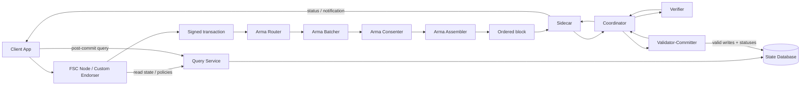
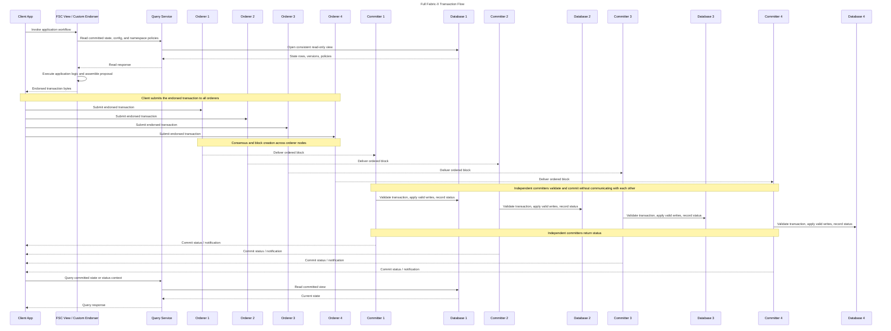
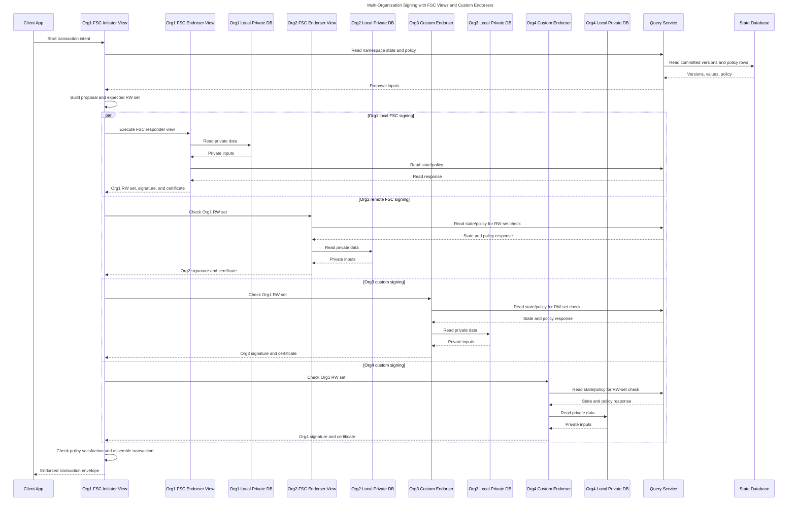
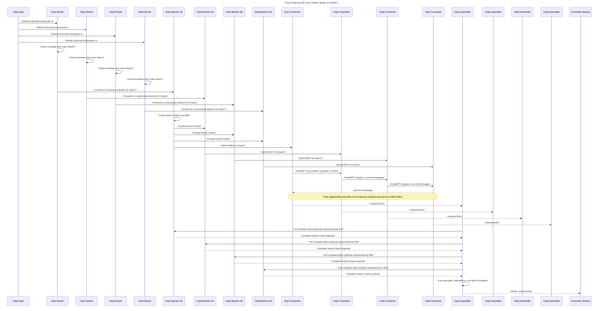
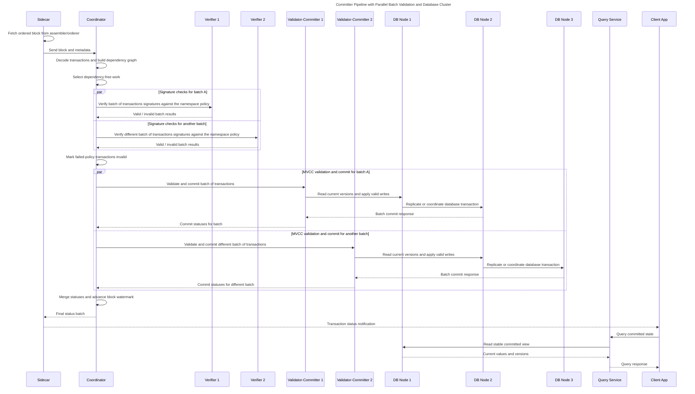

<!-- SPDX-License-Identifier: Apache-2.0 -->
# End-to-End Transaction Flow in Fabric-X

## Overview

Fabric-X follows execute-order-validate-commit. Applications create endorsed transactions, Arma orders transaction bytes into blocks, and the committer pipeline validates authorization and state before committing results.

The flow has two important read/status loops. Before submission, FSC nodes or custom endorsers may read committed state and policies through the Query Service to build endorsed transaction data. After ordering and commit processing, clients learn final status from the committer and can query committed state through the same database-backed read path.

## Flow Diagram

At a high level, Fabric-X starts with application execution outside the orderer. A client invokes an FSC view or custom endorser, which reads committed public state, policies, and configuration through the Query Service. Endorsers may also read local private databases when endorsement logic depends on privacy-preserving data that should not be exposed through the shared state path.

The endorsed transaction is then submitted to the Arma orderer nodes. Arma orders transaction bytes into blocks; it does not evaluate endorsement policies, run MVCC checks, or decide whether a transaction changes application state. Ordering gives the transaction a deterministic block position and makes the block available to committers.

Each committer validates and commits independently against its colocated database. The committer verifies signatures and namespace policies, checks read versions, applies valid writes, records final status, and returns that status to clients. Clients should use committer status and Query Service reads after commit to observe final state.

## Full Transaction Sequence

The full flow starts with execution, not ordering. Client code invokes an FSC view or custom endorser, and endorsement logic reads committed state through the Query Service. Those reads return database versions and policy/configuration data that become inputs to the transaction read set, write set, and signatures.

After endorsement, the client submits immutable transaction bytes to Arma. The overview treats each orderer node as one box and leaves router, batcher, consenter, and assembler details to the dedicated orderer sequence below. At this point the transaction is ordered, but it is not yet valid or committed.

The committer pipeline gives each ordered transaction a final outcome. In this overview, each committer is independent and colocated with its own database: each receives a block from its paired orderer, validates and commits locally, and returns status without communicating with other committers. The dedicated committer sequence below expands the internals of one committer pipeline. Clients should treat committer status, not orderer acceptance, as transaction finality.

## Detailed Signing Sequence

**Phase 1: Execute / Endorse.** Application logic runs before ordering. In Fabric-X this is commonly implemented with Fabric Smart Client views or another application-level endorsement flow.

The signing sequence shows four organizations participating before the transaction reaches the orderer. Org1 drives the FSC initiator view, Org1 and Org2 can endorse through FSC responder views, and Org3 and Org4 can represent custom endorser services. The resulting transaction can mix endorsement mechanisms as long as final signatures satisfy the namespace policy checked later by the committer.

FSC views support interactive protocols. The initiator can prepare proposal inputs, contact other FSC nodes, exchange application messages, and collect signatures over the proposed read/write effects. Org1 generates the initial read/write set. Other endorsers verify that read/write set by reading committed state and policy through the Query Service, and each organization may also read a local private database for privacy-preserving endorsement inputs.

Custom endorsers model endorsement logic as external services. They can implement domain-specific validation or cryptographic signing outside FSC while still returning Fabric-X-compatible endorsement material. The diagram labels these calls as gRPC because custom endorsers are service-style participants, not local view invocations.

During this phase, an FSC node or custom endorser executes business logic and may read current committed state through the Query Service. The read results become part of the transaction's read set or otherwise influence the proposed write set. The result is a transaction with an identifier, namespace read/write information, endorsements or signatures for affected namespaces, and data needed by the committer to verify policies and validate reads.

Endorsement does not mutate the database. It produces signed evidence that organizations accepted proposed effects under current inputs. The committer later re-checks signatures, policies, and read versions, so endorsement success alone does not guarantee commit success.

## Detailed Orderer Sequence

**Phase 2: Order with Arma.** Arma provides the ordering service. Routers accept client submissions and forward requests, batchers group requests into batches and produce batch attestation material, consenters run consensus over ordering metadata, and assemblers gather ordered batches and produce blocks.

The orderer sequence separates submission, batching, consensus, and assembly. Four orderer nodes are shown, each with a router, a shard-0 batcher, a consenter, and an assembler. Routers are the client-facing entry point and can exist in multiple organizations. They do not perform endorsement-policy or MVCC validation; they route accepted transaction bytes to the batcher shard responsible for that traffic.

Shard 0 receives the same example transaction through all routers. The primary batcher creates the shard batch and BAF, forwards the batch to secondary batchers, and each batcher submits BAF material for consensus.

The four consenters represent four organizations running the BFT ordering protocol. Consensus is over batch attestation fragments and ordering metadata, not over database state. With four replicas, the protocol can tolerate one Byzantine fault under the usual n=3f+1 model, while still producing a deterministic order for batches.

Assemblers complete the orderer output. They observe ordered attestations, pull the complete batch payload represented by the BAF from shard-0 batchers, and fuse the data into blocks. Delivery to the committer sidecar transfers ordered blocks into validation and commit processing. Ordering creates a deterministic block position for transaction bytes, but it does not mean the transaction will update world state.

## Detailed Committer Sequence

**Phase 3: Validate and Commit.** The committer pipeline processes each ordered block, turns ordered transactions into durable outcomes, and records final status for every transaction.

The committer sequence starts after ordering. The sidecar fetches or receives ordered blocks and streams them to the coordinator. The coordinator decodes transactions, extracts read/write sets, and builds a dependency graph so independent work can run in parallel without violating read/write ordering constraints.

Verifiers handle authorization checks. They validate signatures against namespace policies for assigned batches of transactions. Transactions that fail these checks receive final invalid statuses and do not move to MVCC validation, but the block pipeline continues processing other transactions.

Validator-committers perform state validation and persistence. They compare transaction read versions against committed database versions, reject MVCC conflicts, apply valid writes, and record statuses. Multiple validator-committers can process batches of transactions in parallel while the database cluster coordinates durability and consistency.

The database cluster is the source of committed truth for both write and read paths. Once validator-committers finish, the coordinator merges statuses and advances block progress, then the sidecar returns final status notifications. Valid transactions update namespace state. Invalid transactions do not update application state, but they still receive final statuses so clients can distinguish policy failures, MVCC conflicts, malformed transactions, and successful commits. Clients and endorsers use the Query Service after finality to observe stable committed state rather than reading from in-flight pipeline state.

## Read Path

The Query Service is not part of the commit path. It serves read-only access to committed state, namespace policies, and configuration through database views.

This read path is used both before and after commit processing. Before submission, endorsers read state and policies to build transaction proposals. After finality, clients and endorsers read the updated committed state and use status/notification results to decide follow-up work.

## Status Lifecycle

Transaction status is finalized by the committer. Common outcomes include committed, signature or policy invalid, MVCC conflict, and other validation failures defined by committer protobuf status values.

A transaction can therefore be ordered but not committed. Applications should wait for committer status before treating a transaction as final, then use the Query Service to observe committed state.

## See Also

- [Fabric-X Model](fabric-x-model.md)
- [Arma Ordering](../orderer/docs/architecture.md)
- [Committer Pipeline](../committer/docs/architecture.md)
- [Dependency Graph](../committer/docs/coordinator.md)
- [Fabric-X Committer Architecture](https://hyperledger.github.io/fabric-x-committer/architecture/)
- [Sidecar](https://hyperledger.github.io/fabric-x-committer/sidecar/)
- [Coordinator](https://hyperledger.github.io/fabric-x-committer/coordinator/)
- [Verification Service](https://hyperledger.github.io/fabric-x-committer/verification-service/)
- [Validator-Committer](https://hyperledger.github.io/fabric-x-committer/validator-committer/)
- [Query Service](https://hyperledger.github.io/fabric-x-committer/query-service/)
