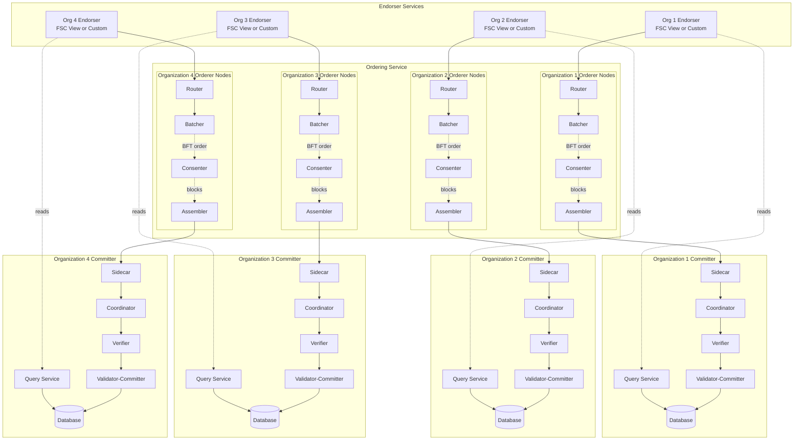

<!-- SPDX-License-Identifier: Apache-2.0 -->
# Introduction

Generally, a blockchain is an immutable transaction ledger, maintained
within a distributed network of _peer nodes_. These nodes each maintain a copy
of the ledger by applying transactions that have been validated by a _consensus
protocol_, grouped into blocks that include a hash that binds each block to the
preceding block.

The first and most widely recognized blockchain application is the
[Bitcoin](https://en.wikipedia.org/wiki/Bitcoin) cryptocurrency, though others
have followed in its footsteps. Ethereum, an alternative cryptocurrency, took a
different approach, integrating many of the same characteristics as Bitcoin but
adding _smart contracts_ to create a platform for distributed applications.
Bitcoin and Ethereum fall into a class of blockchain that we would classify as
_public permissionless_ blockchain technology. Basically, these are public
networks, open to anyone, where participants interact anonymously.

As the popularity of Bitcoin, Ethereum, and a few other derivative technologies
grew, interest in applying the underlying technology of the blockchain,
distributed ledger, and distributed application platform to more innovative
_enterprise_ use cases also grew. However, many enterprise use cases require
performance characteristics that permissionless blockchain technologies are
unable (presently) to deliver. In addition, in many use cases, the identity of
the participants is a hard requirement, such as in the case of financial
transactions where Know-Your-Customer (KYC) and Anti-Money Laundering (AML)
regulations must be followed.

For enterprise use, we need to consider the following requirements:

- Participants must be identified/identifiable
- Networks need to be _permissioned_
- High transaction throughput performance
- Low latency of transaction confirmation
- Privacy and confidentiality of transactions and data pertaining to business
  transactions

While many early blockchain platforms are currently being _adapted_ for
enterprise use, Hyperledger Fabric has been _designed_ for enterprise use from
the outset. To address enterprise requirements, we developed
[Hyperledger Fabric](https://hyperledger-fabric.readthedocs.io/en/release-2.5).
However, Fabric has performance limitations (~2,000 TPS) that make it unsuitable
for tokenization use cases requiring higher throughput. Additionally, Fabric's
rigid chaincode programming model lacks flexibility. Fabric-X addresses these
limitations by removing chaincodes and introducing a flexible programming model
using [Fabric Smart Client (FSC)](https://github.com/hyperledger-labs/fabric-smart-client)
views. The following sections describe the differences between Fabric-X and
Fabric.

---

## Fabric vs Fabric-X

Fabric-X is an evolution of Hyperledger Fabric, designed for high-performance
enterprise blockchain deployments. It keeps Fabric's core execute-order-validate-commit
architecture while making significant architectural changes to achieve
200,000+ TPS with horizontal scalability.

| Feature | Fabric | Fabric-X |
|---------|--------|----------|
| **Execution Model** | execute-order-validate-commit | execute-order-validate-commit |
| **Endorsement Architecture** | Chaincode (rigid, no access to local/external states, difficult custom logic per org) | FSC Views or custom endorsers (local states, custom logic per organization) |
| **Orderer Architecture** | Monolithic orderer | 4 microservices (Router, Batcher, Consenter, Assembler) - batchers scale horizontally |
| **Committer Architecture** | Monolithic peer | 5 microservices (Sidecar, Coordinator, Verifier, Validator-Committer, Query Service) - verifier, validator-committer, query-service scale horizontally |
| **Ordering** | BFT/Raft | Arma BFT (Byzantine Fault Tolerant) |
| **Channels** | Multi-channel | Single channel with namespaces |
| **Private Data** | Supported | Not implemented |
| **Chaincode** | Go/Java/Node.js | No chaincodes; FSC views |
| **TPS** | ~2,000 | 200,000+ (horizontal scaling) |
| **Query Service** | Query System Chaincode in the peer | Dedicated query service with view-based consistency |
| **Membership Service** | MSP-based | Same |
| **Identity Management** | X.509, Idemix | Same |
| **Policies** | Domain Specific Language (And/Or/NOutOf) | Same |
| **Read-Write Sets** | Read set, Write set | Read only set, Read-Write set, Blind write set |
| **Data Model** | Key-value-version | Key-value-version |
| **Database** | LevelDB, CouchDB | PostgreSQL, YugabyteDB |
| **Configuration/Genesis Block** | Standard config | Almost the same, with extra Fabric-X parameters |

Fabric-X maintains: permissioned membership, MSP-backed identities, policies,
immutable ledger, read/write sets, and execute-order-validate-commit transaction
processing.

---

## Hyperledger Fabric

Hyperledger Fabric is an open-source enterprise-grade permissioned distributed
ledger technology (DLT) platform, designed for use in enterprise contexts.
It features execute-order-validate-commit architecture, MSP-based identity management,
pluggable consensus (BFT/Raft), and smart contracts (chaincode) in
general-purpose languages. For detailed documentation, see
[Hyperledger Fabric Documentation](https://hyperledger-fabric.readthedocs.io/en/release-2.5).

However, Fabric has performance limitations (~2,000 TPS) and a rigid chaincode
programming model, making it unsuitable for high-throughput use cases like
tokenization. Fabric-X addresses these limitations.

## Hyperledger Fabric-X

Fabric-X is built on Fabric's foundations but evolved for next-generation
enterprise requirements. It achieves 200,000+ TPS through architectural
innovation while maintaining Fabric's core principles: permissioned membership,
MSP-backed identities, policy-based governance, and the execute-order-validate-commit
model.

### Architecture Overview

Fabric-X decomposes the monolithic Fabric peer and orderer into microservices
that scale independently. This architectural decomposition enables pipelined
execution, horizontal scalability, and independent resource allocation for each
component based on workload characteristics. The ordering service handles
transaction ordering while the committer service handles validation and state
management.

The ordering service consists of four microservices that work together to
achieve Byzantine fault tolerant consensus on transaction order. The committer
service consists of five microservices that form a validation and commit
pipeline, processing blocks in parallel while maintaining consistency guarantees.

**Ordering Service (4 microservices)**:

- **Routers**: Accept client transactions, perform initial validation, and
  dispatch to batcher shards using hashing
- **Batchers**: Sharded services that bundle transactions into batches,
  persist to disk for durability, and generate Batch Attestation Fragments
  (BAFs) sent to consenters. A BAF is an attestation over the digest of a
  batch, so consensus runs on batch digests rather than full transaction bytes.
  Batcher shards scale horizontally to handle load
- **Consenters**: Run SmartBFT consensus on batch attestations, providing
  Byzantine fault tolerance against malicious nodes
- **Assemblers**: Pull ordered batches, fuse with attestations, and construct
  final blocks for distribution

**Committer Service (5 microservices)**:

- **Sidecar**: Fetches blocks from the ordering service and feeds them into
  the validation pipeline
- **Coordinator**: Orchestrates validation by building dependency graphs,
  enabling parallel transaction processing
- **Verifier**: Validates signatures and enforces namespace policies
- **Validator-Committer**: Performs MVCC validation, applies state updates,
  and commits to the database (PostgreSQL/YugabyteDB)
- **Query Service**: Provides read-only state access with view-based consistency
  guarantees

### Key Innovations

**1. Execute-Order-Validate-Commit Model**

Fabric-X uses the same execute-order-validate-commit model as Fabric, maintaining
compatibility with Fabric's transaction processing semantics. Both platforms
separate transaction execution from ordering, enabling parallel processing and
eliminating non-determinism before consensus is reached.

The model consists of four phases that ensure transaction correctness while
maximizing throughput. The key difference in Fabric-X is the microservices
implementation that enables horizontal scaling of each phase.

- **Execute/Endorse**: FSC views or custom endorsers execute transaction logic
  and produce read/write sets with endorsements
- **Order**: Arma ordering service achieves BFT consensus on transaction order
  and assembles blocks
- **Validate**: Committer services verify signatures, policies, and MVCC
  conflicts using dependency graph parallelism
- **Commit**: Valid transactions are applied to the database; all transactions
  (valid and invalid) are recorded in the ledger

The following diagram shows a four-organization setup where each organization
hosts an endorser, orderer, and committer. This mirrors a typical Fabric-X
network where every organization participates in transaction endorsement,
ordering, validation, commit, and query processing.

Endorsers submit endorsed transactions to the ordering service. The orderers
perform consensus to build blocks, and committers pull those blocks to validate
and commit each transaction in the block.

**2. FSC-Based Endorsement**

Fabric-X eliminates chaincodes in favor of a more flexible endorsement model
based on the Fabric Smart Client (FSC) SDK. This approach removes the Docker
container overhead associated with chaincode execution and enables richer,
stateful application protocols that can maintain local state between transactions.

FSC views provide a programming model where endorsement logic runs as part of
the application process or as standalone services. This enables organization-specific
custom logic, direct access to local state, and interactive protocols between
parties before transaction submission. Custom endorsers can also be built for
non-FSC clients, enabling integration with legacy systems while maintaining
compatibility with the Fabric-X endorsement model.

FSC views and custom endorsers can also provide fine-grained data privacy.
Applications can store sensitive data locally, share it offline only with
required participants, and commit only an anchor or digest to the blockchain.
This keeps confidential payloads outside the shared ledger while preserving an
auditable on-chain reference.

- **Fabric Smart Client (FSC) Views**: Interactive protocols that define
  endorsement logic, running as part of the application or as standalone
  services. FSC views have access to local state and can implement complex,
  organization-specific logic
- **Custom Endorsers**: Standalone endorsement services for non-FSC clients,
  enabling integration with legacy systems

**3. Arma BFT Ordering**

The Arma ordering service implements Byzantine fault tolerant consensus using
the SmartBFT protocol, providing tolerance against malicious nodes while
achieving high throughput. Unlike traditional monolithic orderers, Arma achieves
horizontal scalability through a microservices architecture with sharded batchers
that process transactions in parallel.

Arma's design separates transaction intake, batching, consensus, and block
assembly into distinct services. This separation enables pipelined execution,
consensus on the digest of a batch rather than full transaction bytes, and a
microservice deployment model. Together, these choices allow the system to
achieve 200,000+ TPS with multiple orderer organizations participating in
consensus. The deterministic transaction ordering ensures consistent block
construction across all nodes in the network.

- Byzantine fault tolerance via SmartBFT consensus
- Horizontal scalability through sharded batchers
- 200,000+ TPS with multiple orderer organizations
- Deterministic transaction ordering

**4. Parallel Validation Pipeline**

The committer service achieves high throughput by constructing dependency graphs
that identify independent transactions, enabling parallel MVCC validation across
multiple verifier and validator-committer instances. This approach dramatically
improves validation throughput compared to sequential validation in traditional
blockchain systems.

The validation pipeline scales horizontally, with verifier, validator-committer,
and query service instances that can be added or removed based on load. Direct
integration with PostgreSQL or YugabyteDB provides efficient state management
with optimized schema design and stored procedures for common operations.

- Dependency graph construction for identifying independent transactions
- Parallel MVCC validation across multiple verifier/validator instances
- Horizontal scaling of verifier, validator-committer, and query service
- Direct database integration (PostgreSQL/YugabyteDB) for efficient state
  management

**5. Single Channel with Namespaces**

Unlike Fabric's multi-channel architecture, Fabric-X uses a single shared channel
with namespaces for logical separation of application state and policies. This
design simplifies network management by eliminating the operational overhead of
creating and maintaining multiple channels while still providing isolation
between applications.

Namespaces provide logical scope for application state, endorsement policies,
and validation policies. Each namespace operates independently with its own
state database and policy configuration. Note that Fabric-X does not support
private data collections; applications requiring confidentiality should implement
application-level encryption before transaction data is ordered.

- One shared channel for all participants
- Namespaces for logical separation of application state and policies
- Simplified network management and reduced operational overhead

### Performance Characteristics

Fabric-X achieves 200,000+ TPS through architectural innovations that enable
horizontal scaling and parallel processing. The microservices architecture allows
independent scaling of batchers and committers based on workload characteristics,
ensuring optimal resource utilization across the system.

The combination of sharded ordering, parallel validation through dependency
graphs, elimination of Docker container overhead, and efficient database
integration enables Fabric-X to achieve order-of-magnitude performance
improvements over traditional blockchain platforms. PostgreSQL and YugabyteDB
provide robust, scalable storage with support for advanced features like
stored procedures and distributed transactions.

- **Independent Scaling**: Batchers and committers scale horizontally based
  on load
- **Sharded Ordering**: Multiple batcher shards process transactions in
  parallel
- **Parallel Validation**: Dependency graphs enable concurrent MVCC checks
- **No Container Overhead**: FSC views run without Docker containers
- **Efficient Database**: PostgreSQL/YugabyteDB with optimized schema and
  stored procedures

### Fabric-X Ecosystem

Fabric-X is a collection of projects that provide the building blocks for
enterprise blockchain applications. The Fabric Smart Client (FSC) provides the
view SDK for implementing endorsement protocols, while fabric-x provides sample
networks and the Fabric-X CLI tools such as configtxgen and cryptogen.

The ecosystem includes the actual implementation of all major components:
fabric-x-orderer for the Arma ordering service, fabric-x-committer for the
validation and commit pipeline, and fabric-x-endorser for FSC-based endorsement
frameworks. Additional tools and libraries support application development,
network operations, and monitoring.

- **Fabric Smart Client (FSC)**: View SDK for endorsement protocols ([GitHub](https://github.com/hyperledger-labs/fabric-smart-client))
- **fabric-x**: Integration, samples, end-to-end tests, and CLI tools ([GitHub](https://github.com/hyperledger/fabric-x))
- **fabric-x-common**: Shared MSP and protoutil libraries ([GitHub](https://github.com/hyperledger/fabric-x-common))
- **fabric-x-orderer**: Arma ordering service implementation ([GitHub](https://github.com/hyperledger/fabric-x-orderer))
- **fabric-x-committer**: Validation and commit pipeline services ([GitHub](https://github.com/hyperledger/fabric-x-committer))
- **fabric-x-endorser**: FSC-based endorsement framework ([GitHub](https://github.com/hyperledger/fabric-x-endorser))

## Membership and Identity

Both Fabric and Fabric-X use MSP-based membership services with X.509 and Idemix
identities. The identity management model is identical in both platforms,
providing a consistent approach to participant authentication and authorization
across the network. This compatibility ensures that existing Fabric identity
infrastructure can be reused when migrating to Fabric-X.

The Membership Service Provider (MSP) abstracts the underlying cryptographic
mechanisms, allowing organizations to manage their identities using standard
X.509 certificates or advanced Idemix credentials for enhanced privacy. Each
organization in the network maintains its own MSP, defining the root certificate
authorities and organizational units that constitute its membership.

Fabric-X inherits Fabric's identity model without modification, meaning that
tools and processes for identity generation, certificate rotation, and MSP
configuration remain compatible. The cryptogen and configtxgen CLI tools in
fabric-x can generate cryptographic material and configuration blocks using the
same identity structures as Fabric.

## Policies

Both platforms use the same Domain Specific Language (DSL) based on logical
operators (And, Or, NOutOf) for defining endorsement and validation policies.
This policy language provides a flexible yet simple mechanism for specifying
which organizations must endorse transactions and what conditions must be met
for validation.

Policies in Fabric-X are defined at the namespace level, allowing different
applications to have different endorsement requirements within the same channel.
The policy DSL supports complex combinations, such as requiring endorsements
from a subset of organizations or specific roles within organizations.

The policy evaluation engine in Fabric-X is identical to Fabric's, ensuring
consistent behavior across both platforms. Policies can be updated through
configuration transactions, and the policy framework integrates seamlessly with
the MSP-based identity system to enforce access control and transaction
validation rules.

## Data Model and Database

Both Fabric and Fabric-X use a key-value-version data model, where each state
key maintains a version number that is incremented on every write. This
versioning enables MVCC (Multi-Version Concurrency Control) validation, ensuring
that transactions only commit if their read sets remain valid at commit time.

Fabric supports LevelDB for key-value storage and CouchDB for rich queries with
JSON documents. Fabric-X uses PostgreSQL or YugabyteDB, providing better
performance, horizontal scalability, and advanced database features. PostgreSQL
offers robust ACID compliance, while YugabyteDB adds distributed SQL capabilities
for multi-region deployments.

The choice of PostgreSQL/YugabyteDB in Fabric-X enables optimized schema design,
stored procedures for common operations, and efficient indexing strategies. The
database layer is tightly integrated with the validator-committer service,
reducing latency and improving throughput compared to Fabric's more abstracted
storage layer.

## Configuration and Genesis Block

Fabric-X genesis blocks are almost identical to Fabric's, containing the
configuration for the channel, organizations, MSPs, and policies. The genesis
block structure follows the same format, ensuring compatibility with Fabric's
configuration transaction model and tools.

Fabric-X extends the genesis block with additional parameters required for the
microservices architecture. These include router configuration (endpoint
bindings, batcher discovery), batcher configuration (sharding strategy, disk
paths), consenter configuration (SmartBFT parameters, peer lists), assembler
configuration (block assembly parameters), and committer service configuration
(database connection strings, service discovery endpoints).

The configtxgen binary in fabric-x supports these additional Fabric-X parameters.
Fabric-X configuration generation is not backward compatible with Fabric network
configuration generation because Fabric-X introduces microservices-specific
settings and deployment assumptions.

## Ecosystem

Fabric has a large ecosystem of tools for building, testing, and managing
networks. See the [Fabric Ecosystem](https://lf-hyperledger.atlassian.net/wiki/spaces/fabric/pages/22839837/Ecosystem).

Fabric-X is the collection of the following projects:

- **Fabric Smart Client (FSC)**: View SDK for endorsement protocols ([GitHub](https://github.com/hyperledger-labs/fabric-smart-client))
- **fabric-x**: Integration, samples, end-to-end tests, and CLI tools ([GitHub](https://github.com/hyperledger/fabric-x))
- **fabric-x-common**: Shared MSP and protoutil libraries ([GitHub](https://github.com/hyperledger/fabric-x-common))
- **fabric-x-orderer**: Arma ordering service implementation ([GitHub](https://github.com/hyperledger/fabric-x-orderer))
- **fabric-x-committer**: Validation and commit pipeline services ([GitHub](https://github.com/hyperledger/fabric-x-committer))
- **fabric-x-endorser**: FSC-based endorsement framework ([GitHub](https://github.com/hyperledger/fabric-x-endorser))

## Conclusion

Any serious evaluation of blockchain platforms should include Hyperledger Fabric
in its short list. For high-performance enterprise use cases requiring
200,000+ TPS with BFT consensus, Fabric-X extends Fabric with a microservices
architecture, Arma ordering, and dedicated committer services.

Combined, the differentiating capabilities of Fabric make it a highly scalable
system for permissioned blockchains supporting flexible trust assumptions that
enable the platform to support a wide range of industry use cases ranging from
government, to finance, to supply-chain logistics, to healthcare and so much
more. Fabric-X builds on these capabilities to meet the most demanding
enterprise throughput requirements.

## Acknowledgement

The preceding is derived from
["Fabric-X: Scaling Hyperledger Fabric for Asset Exchange"](https://eprint.iacr.org/2023/1717):

- Elli Androulaki, IBM Research - Zurich
- Marcus Brandenburger, IBM Research - Zurich
- May Buzaglo, IBM Research - Haifa
- Angelo De Caro, IBM Research - Zurich
- Kaoutar Elkhiyaoui, IBM Research - Zurich
- Alexandros Filios, IBM Research - Zurich
- Liran Funaro, IBM Research - Haifa
- Yacov Manevich, IBM Research - Zurich
- Hagar Meir, IBM Research - Haifa
- Senthilnathan Natarajan, IBM Research - Haifa
- Manish Sethi, IBM Research - Thomas J. Watson Research Center
- Yoav Tock, IBM Research - Haifa
