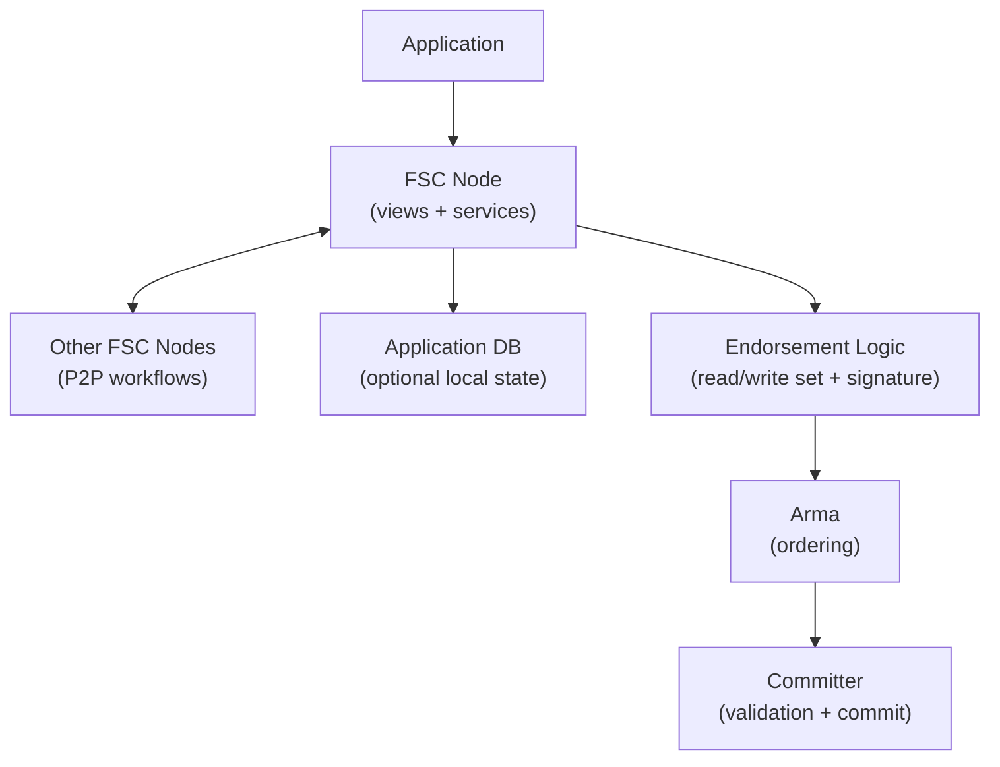

<!-- SPDX-License-Identifier: Apache-2.0 -->
# Key Concepts Overview

This page provides high-level summaries of core Fabric-X concepts. Each section links to detailed documentation.

The goal is to explain how the major ideas fit together before you dive into component-specific pages. Fabric-X keeps many familiar Fabric concepts, such as identities, endorsement, policies, and immutable ledgers, but changes how high-throughput transaction processing is divided across services. Understanding that separation makes the rest of the documentation easier to follow.

## Table of Contents

1. [Blockchain Basics](#blockchain-basics)
2. [Fabric-X Model: Execute-Order-Validate-Commit](#fabric-x-model-execute-order-validate-commit)
3. [FSC Endorsement](#fsc-endorsement)
4. [Arma Ordering Service](#arma-ordering-service)
5. [Committer Pipeline](#committer-pipeline)
6. [Network Structure: Single Channel](#network-structure-single-channel)
7. [Identity and MSP](#identity-and-msp)
8. [Policies](#policies)
9. [Ledger](#ledger)

---

## Blockchain Basics

A blockchain is a distributed, immutable ledger that records transactions across a network of nodes. The distributed nature means no single point of control exists, with all participants maintaining synchronized copies of the ledger. Once transactions are committed, they become immutable and cannot be altered or deleted, ensuring a permanent record. All participants can verify the transaction history, providing transparency across the network. Cryptographic security is maintained through hash chains and digital signatures that ensure data integrity.

In permissioned blockchains like Fabric-X, participants are known and authenticated, enabling enterprise use cases requiring privacy, compliance, and governance. Membership is not open-ended: organizations define who can operate services, submit transactions, endorse proposals, administer configuration, and query state. This makes permissioned ledgers suitable for regulated networks where accountability and policy enforcement are as important as decentralization.

Fabric-X uses this permissioned foundation to support shared infrastructure between multiple organizations. Each participant can independently verify ordered blocks and validation results, while the network still enforces common rules for identity, endorsement, and configuration.

**Learn more**: [Blockchain Deep Dive](../concepts/blockchain.md)

---

## Fabric-X Model: Execute-Order-Validate-Commit

Fabric-X follows Fabric's execute-order-validate-commit pattern. Execution and endorsement happen before ordering in FSC views or custom endorsement logic. Arma orders endorsed transaction bytes. Committer services verify signatures and policies, perform MVCC validation, commit valid writes, and record final status for every transaction.

This separation keeps application execution outside ordering. Ordered block inclusion gives a transaction a deterministic position; final outcome comes from committer validation and commit.

**Learn more**: [Fabric-X Model](../concepts/fabric-x-model.md), [Transaction Flow](../concepts/transaction-flow.md)

---

## FSC Endorsement

**FSC (Fabric Smart Client)** is a client-side framework for building distributed application workflows for Fabric and Fabric-X. It focuses on business logic, peer-to-peer coordination, transaction orchestration, and application-specific state management rather than only chaincode execution.

### FSC Views

FSC applications are organized around **views**: Go functions or protocols that implement interactive business workflows. Views can coordinate with other parties, use local application databases, call services, collect signatures, and construct ledger transactions. This lets endorsement logic be part of a richer distributed workflow instead of only a chaincode invocation.

A view can represent an application process such as issuing a token, transferring an asset, requesting a counterparty signature, or preparing a settlement instruction. Because views run in application-controlled nodes, developers can integrate external systems and local business checks before producing the transaction that Fabric-X orders and commits.

### Custom Endorsers

Fabric-X can also use custom endorsers built for a specific application architecture. These endorsers produce read/write sets and signatures that the committer later verifies against namespace endorsement policies; Fabric-X does not require a predefined custom-endorser programming interface in this overview.

Custom endorsers are useful when an application already has a service boundary, when business logic should run outside FSC, or when teams want tighter control over APIs and deployment shape. The important requirement is compatibility with the transaction and policy material that downstream validation expects.

### Endorsement Flow

1. Client invokes an FSC view or custom endorser.
2. Endorser executes application logic and produces a read/write set.
3. Endorser signs the result with its certificate.
4. Client collects endorsements according to namespace policy.
5. Client submits the endorsed transaction to Arma for ordering.

**Learn more**: [Endorser](../concepts/endorser.md)

---

## Arma Ordering Service

**Arma** is Fabric-X's Byzantine Fault Tolerant ordering service. It accepts endorsed transaction bytes, batches them, reaches agreement on their order, and assembles ordered blocks for committers.

Arma separates ordering from transaction validation. It does not execute application logic, evaluate namespace endorsement policy, or perform MVCC validation. Those checks happen before ordering during endorsement or after ordering during commit processing.

At a high level, Arma uses routers for request admission, batchers for batching, consenters for BFT ordering, and assemblers for block assembly. Detailed service diagrams and operational internals belong in the architecture reference.

**Learn more**: [Architecture Reference](../architecture/index.md)

---

## Committer Pipeline

The **committer pipeline** validates ordered blocks and records final transaction outcomes. It verifies endorsement signatures and namespace policies, checks read versions for MVCC conflicts, commits valid writes to world state, and records status for every transaction.

Commit processing is separate from ordering. A transaction can be ordered by Arma but still be marked invalid if it lacks required endorsements or if its read set is stale at its block position.

Fabric-X also provides a Query Service for read-only access to committed state. Query traffic is kept separate from validation and commit work so applications can read state without coupling to commit workers.

**Learn more**: [Architecture Reference](../architecture/index.md), [Transaction Flow](../concepts/transaction-flow.md)

---

## Network Structure: Single Channel

Fabric-X simplifies network topology with a **single channel + namespaces** model.

### Traditional Fabric: Multi-Channel Complexity

Traditional Fabric requires separate channel configuration for each use case, making cross-channel communication require complex patterns. The operational overhead grows significantly with channel count.

### Fabric-X: Single Channel + Namespaces

Fabric-X uses **one channel** for the entire network, with **namespaces** enabling different endorsement policies per use case. Applications use namespaces to separate business domains and policy scope.

A namespace can be treated as an application or domain boundary within the shared channel. It lets one network host multiple asset types, workflows, or participant groups while keeping a single ordering and commit history. This reduces channel sprawl and makes network-wide upgrades easier to coordinate.

**Benefits**: This approach simplifies deployment and operations, reduces configuration overhead, enables easier governance and upgrades, and provides logical isolation without physical separation.

**Learn more**: [Network Architecture](../concepts/network.md)

---

## Identity and MSP

Fabric-X uses a robust identity model based on **X.509 certificates** and **Membership Service Providers (MSP)**.

### Identities

Every participant including users, nodes, and services has a unique X.509 certificate issued by trusted Certificate Authorities (CAs). Each identity includes a distinguished name, organizational unit, and roles.

Identities are used both for transport security and for application authorization. A service certificate can prove which organization operates a node, while a transaction signature can prove which participant endorsed or submitted a transaction. This shared identity foundation lets policies refer to organizations and roles instead of hard-coded keys.

### MSP (Membership Service Provider)

The MSP defines **who is trusted** in the network by mapping certificates to logical roles such as admin, member, and client. It enforces authentication and authorization policies while supporting multiple MSPs for multi-organization networks.

### Key Identity Concepts

A **Principal** represents an identity and role combination (e.g., `Org1.admin`). A **Signature Policy** specifies which principals must sign a transaction. **Role-Based Access Control** ties permissions to MSP roles.

**Learn more**: [Identity](../concepts/identity.md), [MSP](../concepts/msp.md)

---

## Policies

Policies govern **who can do what** in Fabric-X.

### Policy Types

**Signature Policies** specify which identities must endorse transactions. For example, `AND('Org1.peer', 'Org2.peer')` requires both organizations to endorse.

**Implicit Metadata Policies** define default governance rules derived from organization membership and administrator roles. They are used when an explicit policy is not set on a resource, allowing network configuration and administrative operations to inherit consistent organization-level authorization rules. Common rules include `ANY` (at least one organization approves), `ALL` (every organization approves), and `MAJORITY` (more than half of organizations approve).

### Policy Evaluation

Policies are evaluated during validation. Failed policy checks result in transaction rejection. Policies are changed through governed configuration updates, so participants can audit who approved changes and when they took effect.

Policy evaluation turns signatures into governance decisions. For example, a transaction may carry several valid signatures, but validation still fails if those signers do not match the namespace policy. This distinction is important: cryptographic validity proves who signed, while policy validity proves whether those signatures are sufficient.

**Learn more**: [Policies and Governance](../concepts/policies/policies.md)

---

## Ledger

The Fabric-X ledger consists of **world state** and **transaction log**.

### World State

The world state contains the current values of all ledger keys. It is stored in PostgreSQL or YugabyteDB and is updated by validator-committers after transactions pass validation.

Applications and endorsers read world state when they need current values for business logic. Because world state represents only latest committed values, it is optimized for current-state queries rather than historical audit. Historical reconstruction comes from the transaction log.

### Transaction Log (Blockchain)

The transaction log maintains an immutable history of all transactions, organized into blocks ordered by Arma. Each block contains a block header with number, hash, and previous hash, all transactions both valid and invalid, and block metadata including signatures and validation codes.

Keeping invalid transactions in the log is intentional. It records that the network received and ordered the transaction, while validation codes explain why it did not affect world state. This gives operators and auditors a complete view of network activity.

**Learn more**: [Ledger and State Management](../concepts/ledger.md)

---

## Next Steps

- **Hands-On**: Try the [Test Network Tutorial](../tutorials/test-network.md)
- **Architecture**: Review [Architecture Reference](../architecture/index.md) for internals
- **Development**: Start building with the FSC Application Tutorial

### Related Concepts

- [Blockchain](../concepts/blockchain.md) - Distributed ledger fundamentals
- [Fabric-X Model](../concepts/fabric-x-model.md) - Execute-Order-Validate-Commit architecture
- [Network](../concepts/network.md) - Network topology and namespaces
- [Identity](../concepts/identity.md) - X.509 identity model
- [MSP](../concepts/msp.md) - Membership service providers
- [Policies](../concepts/policies/policies.md) - Governance and authorization
- [Committer](../architecture/index.md) - Pipeline architecture details
- [Arma Ordering](../architecture/index.md) - BFT ordering service
- [Endorser](../concepts/endorser.md) - FSC endorsement framework
- [Ledger](../concepts/ledger.md) - State management
- [Namespaces](../concepts/namespaces.md) - Logical isolation
- [Threshold Signatures](../concepts/threshold-signatures.md) - Signature aggregation
