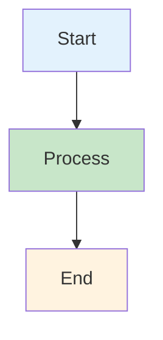
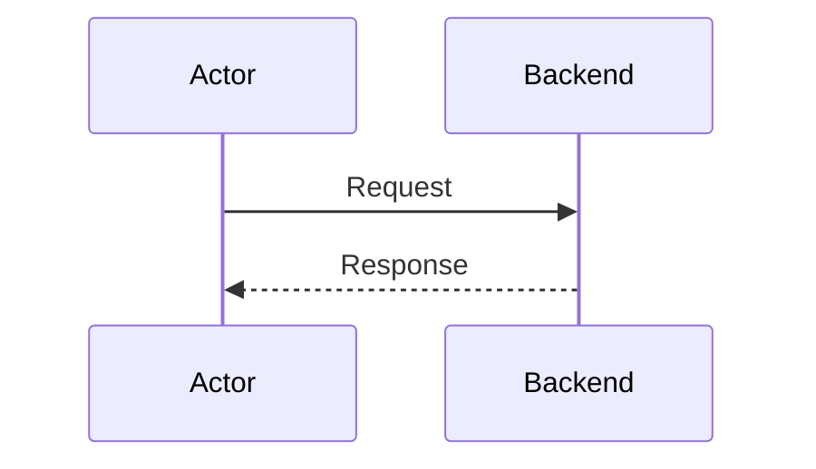

<!-- SPDX-License-Identifier: Apache-2.0 -->
# Contributing to Fabric-X Documentation

## Guidelines

### Diagrams

**All diagrams must be in Mermaid format.** ASCII art is no longer accepted.

#### Flowchart Example


#### Sequence Diagram Example


### Architecture Accuracy

- Verify against source code
- Use correct component names
- Show accurate data flows
- Include all critical components

### Style Guide

- **Headers:** Use sentence case
- **Code:** Use language-specific syntax highlighting
- **Links:** Use relative paths
- **Tables:** Align columns properly

## Review Process

1. Create PR with changes
2. Automated checks (Mermaid syntax)
3. Technical review
4. Merge to main

## Tools

### Local Preview
```bash
mkdocs serve
```

### Building documentation

The root `mkdocs.yml` builds the published Fabric-X documentation site.

Install documentation dependencies:

```bash
python3 -m pip install -r docs/requirements.txt
```

Build the default docs configuration:

```bash
mkdocs build
```

For local component documentation development, keep sibling repositories next to this repository:

```text
github.com/hyperledger/
├── fabric-x
├── fabric-x-orderer
└── fabric-x-committer
```

Then build with the local override config:

```bash
mkdocs build -f mkdocs.local.yml
```

`mkdocs.local.yml` imports selected orderer and committer architecture docs from local sibling repositories using `mkdocs-multirepo-plugin` and local tags named `fabric-x-docs-local`.

Do not use `mkdocs.local.yml` for GitHub Pages or release builds. Published builds must use refs that exist in remote component repositories.

### Mermaid Validation
```bash
# Coming soon to CI pipeline
```

## Questions?

- Check [FAQ](./faq.md)
- Review [Glossary](./glossary.md)
- Open an issue
